# ContextAgent 软件架构设计文档

| 字段 | 内容 |
|------|------|
| 项目名称 | ContextAgent |
| 文档版本 | v1.0 |
| 编写日期 | 2026-03-10 |
| 架构状态 | 草稿 |
| 适用范围 | ContextAgent 核心服务及其与 openJiuwen 框架的集成边界 |

## 架构摘要

> ContextAgent 采用**分层单体 + 异步事件**架构风格，以 openJiuwen Python SDK 为基础框架，通过适配器层隔离对外部存储（向量库、图数据库、KV 缓存）和 openJiuwen 原生组件的直接依赖。系统核心技术栈为 Python 3.11+ / asyncio / FastAPI / openJiuwen / Redis / PostgreSQL+pgvector（默认）/ Milvus（可选）。首要质量目标是**关键路径上下文召回 P95 ≤ 300ms**，同时保证可插拔的压缩/检索策略以适应不同业务场景。

---

## 一、用例视图（Use Case View）

### 1.1 系统上下文模型

#### 系统定位

ContextAgent 是多 Agent 系统中的**上下文管理中枢**，作为 openJiuwen 生态中的专用 Agent，向上层业务 Agent 提供统一的上下文聚合、记忆管理、压缩摘要和检索能力，屏蔽底层存储异构性。

当前实现进一步明确为“**openJiuwen 负责长期记忆底座，ContextAgent 负责记忆编排与注入治理**”：

- 长期记忆落库、检索、更新仍通过 openJiuwen `LongTermMemory`
- ContextAgent 新增 `MemoryOrchestrator`，在 working memory 与长期记忆之间做写入策略编排
- 默认长期记忆后端为 `pgvector`，但只存在于 openJiuwen 配置中，而不是业务代码中

#### 系统边界

- **系统内**：上下文聚合（UC001）、分层记忆管理（UC002）、动态上下文更新（UC003）、JIT 检索（UC004）、混合召回（UC005）、暴露控制（UC006）、Agent 上下文接口（UC007）、记忆异步处理（UC008）、压缩与摘要（UC009）、结构化工作记忆（UC010）、工具治理（UC011）、混合检索（UC012）、版本管理（UC013）、子代理隔离（UC014）、多模态扩展（UC015）、监控（UC016）
- **系统外（外部依赖）**：openJiuwen 框架（LongTermMemory、ContextEngine、Retriever 等）、向量数据库（pgvector 默认，Milvus 等其他 openJiuwen 支持后端可选）、图数据库（可选）、Redis（KV 缓存）、对象存储（S3 兼容）、LLM 服务（压缩/摘要调用）、消息队列（Pulsar，分布式部署可选）、监控存储（Prometheus/InfluxDB）

#### 外部接口清单

| 接口 | 方向 | 协议 | 数据格式 | 说明 |
|------|------|------|----------|------|
| ContextAgent Python SDK | 入 | Python function call (async) | Pydantic 模型 | 业务 Agent 主调用入口 |
| ContextAgent HTTP API | 入 | HTTPS REST | JSON | 跨进程/跨语言调用 |
| openJiuwen LongTermMemory | 双向 | Python in-process | openJiuwen 模型 | 记忆读写 |
| openJiuwen ContextEngine | 双向 | Python in-process | openJiuwen 模型 | 上下文窗口管理 |
| openJiuwen Retriever | 出 | Python in-process | openJiuwen 模型 | 向量/稀疏/图检索 |
| openJiuwen TaskMemoryService | 出 | Python in-process | openJiuwen 模型 | 摘要生成 |
| Redis | 双向 | Redis Protocol / RESP | 二进制/JSON | 热层缓存、分布式锁 |
| 向量数据库（pgvector/Milvus） | 双向 | PostgreSQL / HTTP/gRPC | SQL / JSON/Protobuf | 向量存储与检索 |
| 图数据库（可选） | 双向 | Bolt/HTTP | Cypher/JSON | 图关系检索 |
| LLM 服务 | 出 | HTTPS REST | JSON | 压缩/摘要/冲突检测 |
| 监控存储 | 出 | HTTP push / OTLP | Protobuf | 指标与链路写入 |
| 消息队列（Pulsar，可选） | 双向 | Pulsar Binary Protocol | 二进制 | 异步处理任务队列（分布式部署） |

#### 系统上下文图

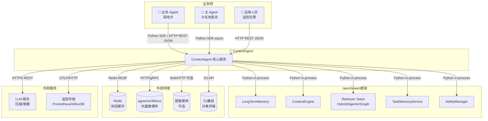

---

### 1.2 关键用例与交互模型

以下选取 3 个代表性用例展示组件级交互序列。

#### 优先级排序（按业务价值）

| 优先级 | 用例 | 理由 |
|--------|------|------|
| P0 | UC007 Agent 上下文接口调用 | 统一对外门面，所有业务 Agent 的入口 |
| P0 | UC002 分层分级记忆管理 | 核心召回路径，直接影响 300ms SLA |
| P1 | UC009 上下文压缩与摘要 | 长会话质量保障 |
| P1 | UC005 混合式召回策略 | 召回质量核心 |
| P2 | UC014 子代理上下文隔离 | 复杂任务协作 |

#### 序列图 1：分层记忆召回（UC002，关键路径）

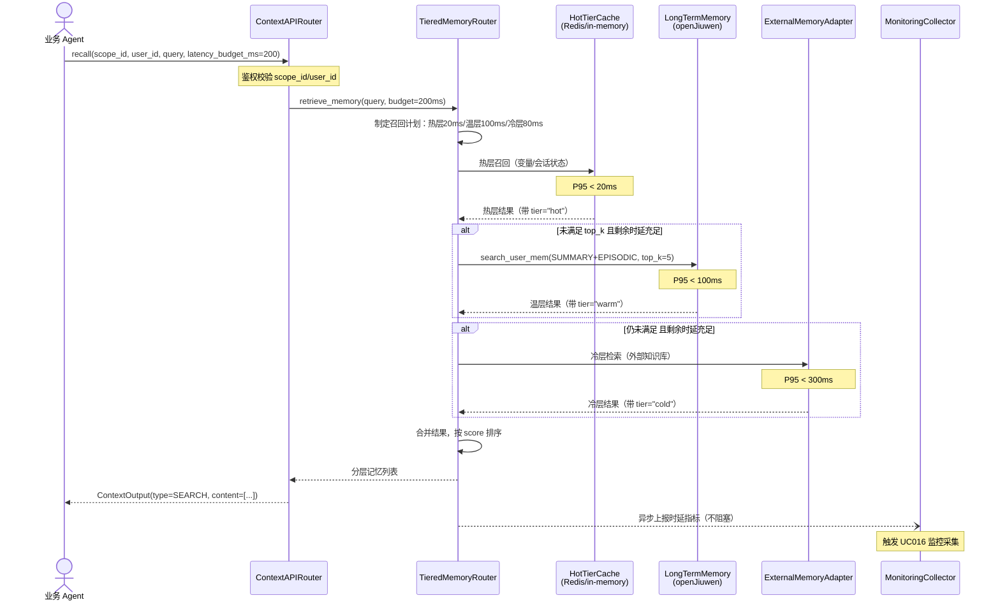

#### 序列图 2：上下文压缩（UC009，含异常路径）

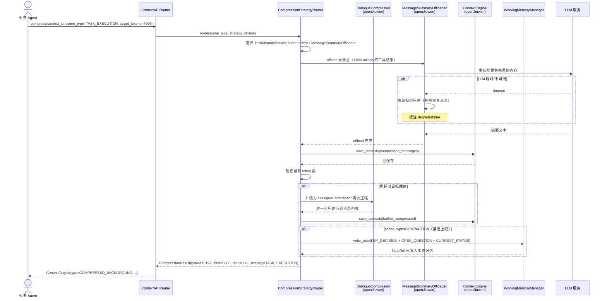

#### 序列图 3：子代理上下文隔离（UC014）

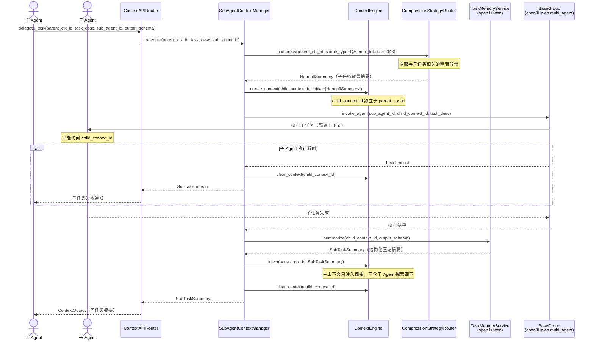

---

## 二、逻辑视图（Logical View）

### 2.1 结构模型

#### 架构风格决策（见 ADR-001）

ContextAgent 采用**分层单体（Layered Monolith）+ 异步事件**架构：单进程内分层解耦，通过 asyncio 事件循环实现非阻塞并发，关键后台任务（记忆处理、监控采集）通过 asyncio.Queue 解耦。

#### 分层结构与职责

| 层次 | 职责 | 关键组件 |
|------|------|----------|
| **接口层** | 对外暴露 SDK 和 HTTP API，统一鉴权 | `ContextAPIRouter`、FastAPI HTTP Handler |
| **编排层** | 跨 UC 流程编排，策略路由 | `ContextAggregator`、`HybridStrategyScheduler`、`CompressionStrategyRouter`、`SubAgentContextManager` |
| **核心层** | 单 UC 业务逻辑 | `TieredMemoryRouter`、`JITResolver`、`ExposureController`、`ContextHealthChecker`、`WorkingMemoryManager`、`ContextVersionManager`、`ToolContextGovernor`、`UnifiedSearchCoordinator`、`AsyncMemoryProcessor`、`MonitoringCollector`、`AlertEngine`、`MultimodalProcessor` |
| **适配层** | 隔离 openJiuwen 内部 API 和外部存储 | `LongTermMemoryAdapter`、`ContextEngineAdapter`、`RetrieverAdapter`、`ExternalMemoryAdapter`、`LLMAdapter` |
| **基础设施层** | 存储、计算、消息队列 | openJiuwen（LTM/CE/Retriever/TMS）、Redis、pgvector/Milvus、图数据库、对象存储、Pulsar |

#### 组件依赖图

```mermaid
graph TD
    subgraph Interface["接口层"]
        APIRouter[ContextAPIRouter<br/>门面/鉴权]
        HTTPHandler[FastAPI HTTP Handler<br/>跨进程调用]
    end

    subgraph Orchestration["编排层"]
        CAgg[ContextAggregator<br/>UC001]
        HSS[HybridStrategyScheduler<br/>UC005]
        CSR[CompressionStrategyRouter<br/>UC009]
        SACM[SubAgentContextManager<br/>UC014]
    end

    subgraph Core["核心层"]
        TMR[TieredMemoryRouter<br/>UC002]
        CHC[ContextHealthChecker<br/>UC003]
        JIT[JITResolver<br/>UC004]
        EC[ExposureController<br/>UC006]
        WMM[WorkingMemoryManager<br/>UC010]
        TCG[ToolContextGovernor<br/>UC011]
        USC[UnifiedSearchCoordinator<br/>UC012]
        CVM[ContextVersionManager<br/>UC013]
        AMP[AsyncMemoryProcessor<br/>UC008]
        MC[MonitoringCollector<br/>UC016]
        AE[AlertEngine<br/>UC016]
        MMP[MultimodalProcessor<br/>UC015]
    end

    subgraph Adapter["适配层"]
        LTMA[LongTermMemoryAdapter]
        CEA[ContextEngineAdapter]
        RETA[RetrieverAdapter]
        EMA[ExternalMemoryAdapter]
        LLMA[LLMAdapter]
    end

    subgraph Infra["基础设施层（openJiuwen + 外部）"]
        LTM[openJiuwen\nLongTermMemory]
        CE[openJiuwen\nContextEngine]
        RET[openJiuwen\nRetriever Stack]
        TMS[openJiuwen\nTaskMemoryService]
        REDIS[(Redis)]
        VEC[(pgvector/Milvus)]
        OBJ[(对象存储)]
    end

    APIRouter --> CAgg & HSS & CSR & SACM & TMR & EC & WMM & TCG & USC & CVM & MMP
    HTTPHandler --> APIRouter

    CAgg --> LTMA & EMA
    TMR --> LTMA & REDIS
    CSR --> LTMA & CEA & LLMA
    JIT --> RETA & LTMA & WMM
    HSS --> RETA & LTMA
    EC --> CEA
    USC --> RETA
    CVM --> CEA & OBJ
    AMP --> LTMA & LLMA
    SACM --> CEA & CSR & TMS
    MMP --> LLMA

    LTMA --> LTM
    CEA --> CE
    RETA --> RET
    LLMA --> LLMA
    LTMA --> REDIS
    USC --> VEC

    MC -.->|异步事件订阅| AE
    AMP -.->|异步队列| AMP
```

---

### 2.2 行为模型

#### 关键业务流程：动态上下文更新（UC003 内部视角）

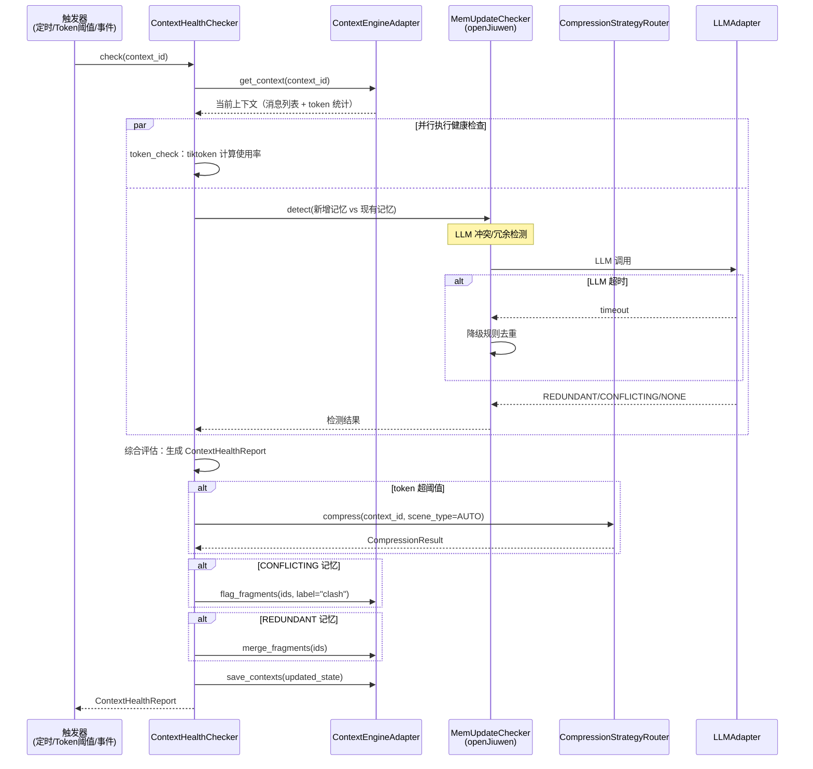

#### 上下文生命周期状态机

```mermaid
stateDiagram-v2
    [*] --> CREATED: create_context(context_id)
    CREATED --> ACTIVE: 首次注入消息
    ACTIVE --> COMPRESSING: token > 80% 阈值\n或显式调用 compress()
    COMPRESSING --> ACTIVE: 压缩完成
    COMPRESSING --> DEGRADED: 压缩失败（回滚原状态）
    DEGRADED --> ACTIVE: 重试成功
    ACTIVE --> SNAPSHOT: create_snapshot()
    SNAPSHOT --> ACTIVE: 快照创建完成
    ACTIVE --> ROLLING_BACK: rollback(version_id)
    ROLLING_BACK --> ACTIVE: 回滚完成
    ACTIVE --> ARCHIVED: session 结束 / TTL 到期
    ARCHIVED --> [*]: 清理

    note right of COMPRESSING: SLA: LLM压缩 P95 < 3s\n规则压缩 P95 < 50ms
    note right of ACTIVE: 健康检查每轮对话后自动触发
```

#### 记忆处理状态机（UC008 异步流水线）

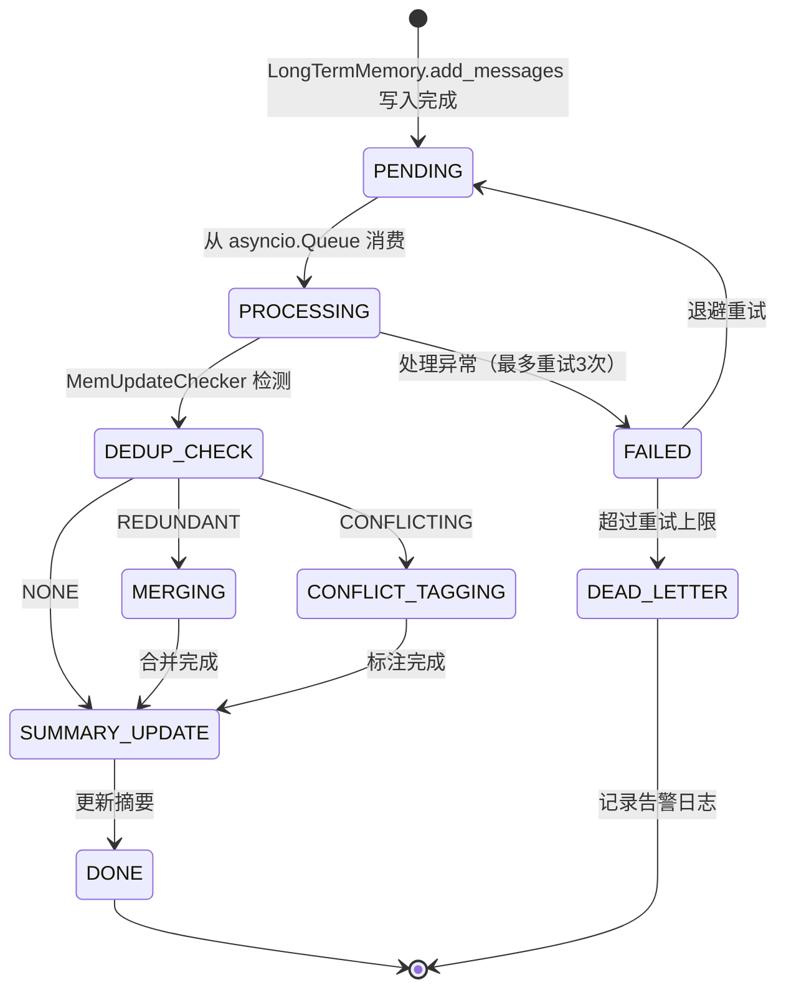

---

### 2.3 数据模型

#### 核心实体 ER 图

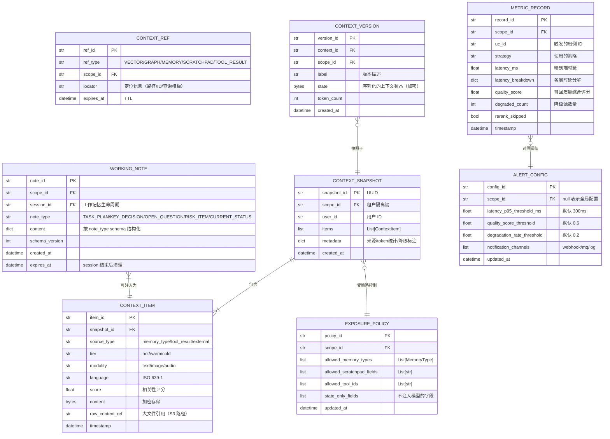

#### 数据所有权边界

| 数据实体 | 所有服务 | 存储后端 | 加密 | 生命周期 |
|----------|---------|----------|------|---------|
| ContextSnapshot（瞬态） | ContextAgent | 内存 | N/A | 请求级 |
| ContextItem（持久） | openJiuwen LTM | KV + 向量库 | AES-256 | 跨 session |
| ContextRef | ContextAgent | Redis KV | N | TTL 可配置 |
| ExposurePolicy | ContextAgent | Redis KV | N | 热更新 |
| WorkingNote | ContextAgent | Redis KV / 文件 | AES-256 | session 级 |
| ContextVersion | ContextAgent | KV + 对象存储 | AES-256 | 50 版本 FIFO |
| MetricRecord | ContextAgent | 时序数据库 | N | 30 天 |
| AlertConfig | ContextAgent | Redis KV | N | 热更新 |

#### 关键索引策略

- `ContextVersion`：按 `(context_id, created_at DESC)` 索引，支持快速查最新版本
- `MetricRecord`：按 `(scope_id, timestamp, uc_id)` 分区，支持时间窗口聚合
- `WorkingNote`：按 `(scope_id, session_id, note_type)` 索引，支持快速注入
- `ExposurePolicy`：Redis Hash，按 `policy_id` O(1) 查找，支持热更新

---

### 2.4 技术模型

#### 技术选型清单

| 类别 | 技术 | 版本 | 用途 | 选型理由 |
|------|------|------|------|----------|
| 语言 | Python | 3.11+ | 全栈实现 | openJiuwen 框架语言，asyncio 原生支持 |
| 基础框架 | openJiuwen | latest | 记忆/上下文/检索原生能力 | 项目基础框架，避免重复实现 |
| 数据校验 | Pydantic | 2.x | 数据模型/接口校验 | openJiuwen 已使用，类型安全 |
| HTTP 框架 | FastAPI | 0.115+ | HTTP API 暴露 | 原生 asyncio，自动 OpenAPI 文档，Pydantic 集成 |
| 并发框架 | asyncio | stdlib | 非阻塞并发 | Python 原生，与 openJiuwen 一致 |
| 热层缓存 | Redis | 7.x | 热层 KV 缓存、分布式锁、ExposurePolicy | 高性能，支持 TTL，openJiuwen 已有 Redis 扩展 |
| 向量数据库 | PostgreSQL+pgvector（默认）/ Milvus（可选） | PostgreSQL 16+ / pgvector 0.7+ / Milvus 2.4+ | 向量存储与语义检索 | pgvector 便于与业务数据统一治理，Milvus 适合高吞吐场景 |
| 图数据库 | Neo4j（可选） | 5.x | 图关系检索 | openJiuwen GraphRetriever 兼容 |
| 对象存储 | MinIO（私有化）/ AWS S3 | MinIO RELEASE.2024+ | 版本快照、大文件引用 | openJiuwen aioboto3 适配器已支持 |
| 消息队列 | asyncio.Queue（默认）/ Pulsar（分布式） | Pulsar 3.x | 异步记忆处理任务队列 | openJiuwen Pulsar 扩展已存在 |
| 可观测性 | OpenTelemetry | 1.x | 统一链路追踪采集 | 厂商中立，与 openJiuwen callback events 集成 |
| 指标存储 | Prometheus（推荐）/ InfluxDB | Prometheus 2.x | 时延/质量指标存储 | 事实标准，Grafana 生态完善 |
| 链路追踪 | Jaeger | 1.x | 分布式链路可视化 | OTLP 兼容 |
| 包管理 | Python venv + pip | stdlib / latest | 依赖管理/虚拟环境 | 与项目安装脚本一致，部署路径更直接 |
| 测试框架 | pytest + pytest-asyncio | pytest 8.x | 单元/集成测试 | Python 生态标准 |

#### 技术栈框图

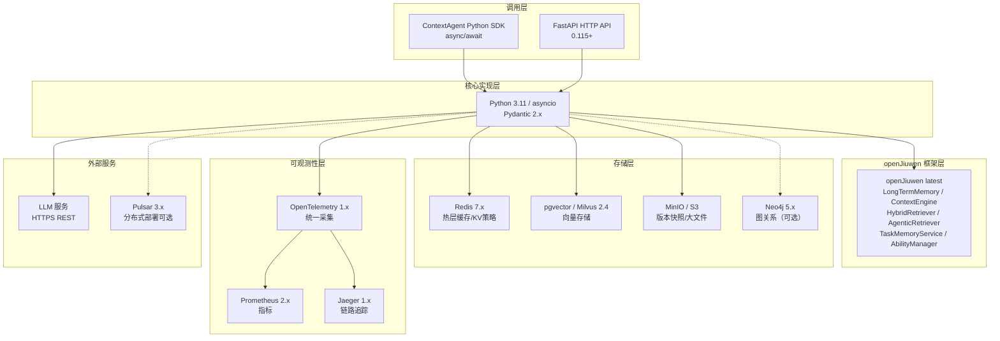

---

## 三、开发视图（Development View）

### 3.1 代码模型

#### 仓库组织策略

采用**单仓库（Monorepo）**：ContextAgent 是单一 Python 包，代码结构清晰、构建简单，与 openJiuwen 风格一致。

#### 目录结构

```
context_agent/                          # 根目录（Python 包）
├── context_agent/                      # 主包
│   ├── __init__.py                     # 公开 API 入口：ContextAgent, ContextAPIRouter
│   ├── api/                            # 接口层
│   │   ├── router.py                   # ContextAPIRouter：统一门面，output_type 路由
│   │   ├── http_handler.py             # FastAPI 路由定义（HTTP API）
│   │   ├── auth.py                     # scope_id/user_id 鉴权中间件
│   │   └── schema.py                   # HTTP 请求/响应 Pydantic 模型
│   ├── orchestration/                  # 编排层
│   │   ├── aggregator.py               # ContextAggregator（UC001）
│   │   ├── strategy_scheduler.py       # HybridStrategyScheduler（UC005）
│   │   ├── compression_router.py       # CompressionStrategyRouter（UC009）
│   │   └── sub_agent_manager.py        # SubAgentContextManager（UC014）
│   ├── core/                           # 核心层（单 UC 业务逻辑）
│   │   ├── memory/
│   │   │   ├── tiered_router.py        # TieredMemoryRouter（UC002）
│   │   │   ├── async_processor.py      # AsyncMemoryProcessor（UC008）
│   │   │   └── working_memory.py       # WorkingMemoryManager（UC010）
│   │   ├── context/
│   │   │   ├── health_checker.py       # ContextHealthChecker（UC003）
│   │   │   ├── jit_resolver.py         # JITResolver（UC004）
│   │   │   ├── exposure_controller.py  # ExposureController（UC006）
│   │   │   └── version_manager.py      # ContextVersionManager（UC013）
│   │   ├── retrieval/
│   │   │   ├── search_coordinator.py   # UnifiedSearchCoordinator（UC012）
│   │   │   └── tool_governor.py        # ToolContextGovernor（UC011）
│   │   ├── multimodal/
│   │   │   └── processor.py            # MultimodalProcessor（UC015）
│   │   └── monitoring/
│   │       ├── collector.py            # MonitoringCollector（UC016）
│   │       └── alert_engine.py         # AlertEngine（UC016）
│   ├── adapters/                       # 适配层（隔离 openJiuwen 内部 API）
│   │   ├── ltm_adapter.py              # LongTermMemoryAdapter
│   │   ├── context_engine_adapter.py   # ContextEngineAdapter
│   │   ├── retriever_adapter.py        # RetrieverAdapter
│   │   ├── external_memory_adapter.py  # ExternalMemoryAdapter（抽象基类 + 实现）
│   │   └── llm_adapter.py              # LLMAdapter
│   ├── models/                         # 数据模型（Pydantic）
│   │   ├── context.py                  # ContextSnapshot, ContextItem, ContextView, ContextOutput
│   │   ├── ref.py                      # ContextRef（JIT 引用）
│   │   ├── policy.py                   # ExposurePolicy
│   │   ├── note.py                     # WorkingNote, NoteRef, note_type schemas
│   │   ├── version.py                  # ContextVersionRecord
│   │   └── metrics.py                  # MetricRecord, AlertConfig
│   ├── strategies/                     # 可插拔策略实现
│   │   ├── base.py                     # CompressionStrategy 抽象接口
│   │   ├── qa_strategy.py              # QA 场景压缩策略（包装 DialogueCompressor）
│   │   ├── task_strategy.py            # 任务执行策略（包装 TaskMemoryService）
│   │   ├── long_session_strategy.py    # 长会话滚动摘要策略
│   │   ├── realtime_strategy.py        # 高实时低成本策略（CurrentRoundCompressor）
│   │   └── compaction_strategy.py      # 高保真 Compaction 策略
│   ├── config/                         # 配置管理
│   │   ├── settings.py                 # 全局配置（pydantic-settings）
│   │   └── defaults.py                 # 默认阈值常量
│   └── utils/                          # 工具
│       ├── logging.py                  # 结构化日志（structlog）
│       ├── tracing.py                  # OTel trace context 工具
│       └── errors.py                   # 错误码定义和异常类
├── tests/
│   ├── unit/                           # 单元测试（与 core/ 同结构）
│   │   ├── core/
│   │   ├── adapters/
│   │   └── strategies/
│   ├── integration/                    # 集成测试（真实 Redis/向量库）
│   │   ├── test_tiered_recall.py       # UC002 端到端
│   │   ├── test_compression.py         # UC009 端到端
│   │   └── test_monitoring.py          # UC016 指标采集
│   └── performance/                    # 性能回归测试
│       └── test_latency_sla.py         # 关键路径 P95 ≤ 300ms 验证
├── docs/                               # 文档
│   ├── requirements-analysis.md        # 需求分析文档
│   └── architecture-design.md          # 本文档
├── examples/                           # 使用示例
│   ├── basic_recall.py
│   └── sub_agent_delegation.py
├── pyproject.toml                      # 包配置
├── requirements.txt                    # 依赖快照（可选）
└── Makefile                            # 构建/测试快捷命令
```

#### 逻辑组件 → 代码路径映射

| 逻辑组件 | 代码路径 | 关键类/接口 |
|----------|----------|-------------|
| ContextAPIRouter (UC007) | `api/router.py` | `ContextAPIRouter`, `OutputType` |
| ContextAggregator (UC001) | `orchestration/aggregator.py` | `ContextAggregator`, `AggregationOptions` |
| TieredMemoryRouter (UC002) | `core/memory/tiered_router.py` | `TieredMemoryRouter`, `TierConfig` |
| ContextHealthChecker (UC003) | `core/context/health_checker.py` | `ContextHealthChecker`, `HealthReport` |
| JITResolver (UC004) | `core/context/jit_resolver.py` | `JITResolver`, `ContextRef`, `RefType` |
| HybridStrategyScheduler (UC005) | `orchestration/strategy_scheduler.py` | `HybridStrategyScheduler`, `StrategyDecision` |
| ExposureController (UC006) | `core/context/exposure_controller.py` | `ExposureController`, `ExposurePolicy` |
| AsyncMemoryProcessor (UC008) | `core/memory/async_processor.py` | `AsyncMemoryProcessor`, `MemoryTask` |
| CompressionStrategyRouter (UC009) | `orchestration/compression_router.py` | `CompressionStrategyRouter`, `CompressionStrategy` |
| WorkingMemoryManager (UC010) | `core/memory/working_memory.py` | `WorkingMemoryManager`, `WorkingNote`, `NoteType` |
| ToolContextGovernor (UC011) | `core/retrieval/tool_governor.py` | `ToolContextGovernor`, `ToolSelection` |
| UnifiedSearchCoordinator (UC012) | `core/retrieval/search_coordinator.py` | `UnifiedSearchCoordinator`, `RetrievalPlan` |
| ContextVersionManager (UC013) | `core/context/version_manager.py` | `ContextVersionManager`, `ContextVersionRecord` |
| SubAgentContextManager (UC014) | `orchestration/sub_agent_manager.py` | `SubAgentContextManager`, `HandoffSummary` |
| MultimodalProcessor (UC015) | `core/multimodal/processor.py` | `MultimodalProcessor`, `MultimodalContent` |
| MonitoringCollector + AlertEngine (UC016) | `core/monitoring/` | `MonitoringCollector`, `AlertEngine`, `AlertConfig` |
| CompressionStrategy（接口） | `strategies/base.py` | `CompressionStrategy` (ABC) |
| ExternalMemoryAdapter（接口） | `adapters/external_memory_adapter.py` | `ExternalMemoryAdapter` (ABC) |

#### 核心接口定义

```python
# strategies/base.py — 可插拔压缩策略接口
class CompressionStrategy(ABC):
    strategy_id: str
    @abstractmethod
    async def compress(
        self,
        context_id: str,
        messages: list[BaseMessage],
        target_tokens: int,
        options: CompressionOptions,
    ) -> CompressionResult: ...

# adapters/external_memory_adapter.py — 外部存储适配接口
class ExternalMemoryAdapter(ABC):
    @abstractmethod
    async def search(self, scope_id: str, user_id: str, query: str, top_k: int) -> list[ContextItem]: ...
    @abstractmethod
    async def fetch_by_ref(self, ref: ContextRef) -> ContextItem | None: ...

# api/router.py — 统一门面
class ContextAPIRouter:
    async def get_context(
        self,
        scope_id: str,
        user_id: str,
        output_type: OutputType,  # SNAPSHOT|SUMMARY|SEARCH|COMPRESSED_BACKGROUND
        options: ContextOptions | None = None,
    ) -> ContextOutput: ...
```

---

### 3.2 构建模型

#### 构建工具链

| 工具 | 版本 | 用途 |
|------|------|------|
| python3 -m venv + pip | Python stdlib | 依赖管理、虚拟环境 |
| pytest | 8.x | 测试运行器 |
| pytest-asyncio | 0.23+ | 异步测试支持 |
| ruff | 0.4+ | Lint + 格式化（替代 flake8 + black） |
| mypy | 1.x | 静态类型检查 |
| Docker | 25+ | 镜像构建 |

#### 测试策略

| 测试层 | 范围 | 覆盖率目标 | 工具 |
|--------|------|-----------|------|
| 单元测试 | 各核心类独立逻辑 | 行覆盖率 ≥ 80% | pytest + mock |
| 集成测试 | UC 端到端（真实 Redis/向量库） | 关键路径 ≥ 90% | pytest + testcontainers |
| 性能回归测试 | 关键路径 P95 时延 | P95 ≤ 300ms | pytest-benchmark |
| 契约测试 | openJiuwen 适配器接口 | 主要接口 100% | pytest |

#### CI/CD 流水线

```mermaid
graph LR
    subgraph CI["CI 流水线（每次 Push/PR）"]
        Lint[代码检查<br/>ruff + mypy] --> UnitTest[单元测试<br/>pytest 覆盖率≥80%]
        UnitTest --> IntTest[集成测试<br/>testcontainers Redis+向量库]
        IntTest --> PerfTest[性能回归测试<br/>P95≤300ms 验证]
        PerfTest --> Scan[安全扫描<br/>pip-audit + bandit]
        Scan --> DockerBuild[镜像构建<br/>Docker Buildx multi-arch]
        DockerBuild --> Push[推送镜像<br/>Container Registry]
    end

    subgraph CD["CD 流水线（合并到 main）"]
        Push --> DeployDev[部署开发环境<br/>自动]
        DeployDev --> SmokeTest[冒烟测试<br/>关键接口健康检查]
        SmokeTest --> DeployStaging[部署预发环境<br/>自动]
        DeployStaging --> Approval{人工审批}
        Approval -->|通过| DeployProd[部署生产环境<br/>滚动更新]
    end
```

#### Makefile 快捷命令

```makefile
# Makefile
lint:       .venv/bin/python3 -m ruff check . && .venv/bin/python3 -m mypy context_agent/
test:       .venv/bin/python3 -m pytest tests/unit/ -v --cov=context_agent --cov-report=term
test-int:   .venv/bin/python3 -m pytest tests/integration/ -v
test-perf:  .venv/bin/python3 -m pytest tests/performance/ -v --benchmark-only
build:      docker buildx build --platform linux/amd64,linux/arm64 -t context-agent:$(VERSION) .
```

---

### 3.3 硬件模型

#### 各组件资源要求

| 组件 | CPU | 内存 | 存储 | 备注 |
|------|-----|------|------|------|
| ContextAgent 服务 | 2 核 | 4 GB | 10 GB（日志） | 无 GPU 需求 |
| Redis（热层缓存） | 2 核 | 8 GB | 20 GB SSD | 含持久化 AOF |
| PostgreSQL + pgvector（默认） | 2 核 | 8 GB | 100 GB SSD | 本地默认部署 |
| Milvus（向量库，生产） | 4 核 | 16 GB | 500 GB SSD | 独立集群 |
| Prometheus + Grafana | 2 核 | 4 GB | 200 GB（30天指标） | 监控节点 |

#### 环境配置差异

| 配置项 | 开发环境 | 预发环境 | 生产环境 |
|--------|----------|----------|----------|
| ContextAgent 副本 | 1 | 2 | 3-10（自动扩缩） |
| Redis 模式 | 单节点（in-memory） | 单节点持久化 | 主从（1主2从） |
| 向量库 | pgvector（本地） | pgvector（独立） | Milvus 集群 |
| LLM 服务 | Mock / 本地小模型 | 沙箱 API | 生产 API |
| 消息队列 | asyncio.Queue | asyncio.Queue | Pulsar 集群 |

#### 硬件配置框图

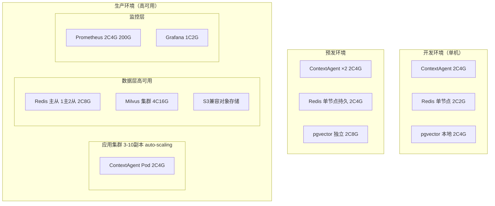


---

## 四、运行视图（Process View）

### 4.1 运行模型

#### 进程/协程并发模型

ContextAgent 采用**单进程 + asyncio 事件循环**并发模型：

- **主事件循环**：处理所有业务请求（recall、compress、aggregate 等），全链路非阻塞 async/await
- **后台协程**：`AsyncMemoryProcessor` 维护独立 asyncio.Queue，后台消费记忆处理任务，不占用请求处理协程
- **定时任务**：`ContextHealthChecker` 定时检查（每轮对话后触发），`AlertEngine` 滑动窗口检查（每 30s 执行一次）
- **HTTP Server**：FastAPI + uvicorn（异步 ASGI），工作进程数 = CPU 核心数 × 2

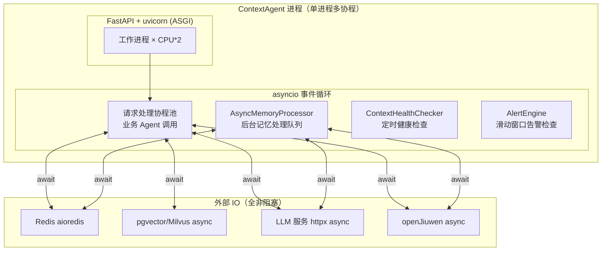

#### 高可用策略

| 故障场景 | 检测机制 | 恢复策略 | RTO 目标 |
|----------|----------|----------|---------|
| ContextAgent 实例故障 | K8s Liveness Probe（/health/live，10s 间隔） | 自动重启 + 流量摘除 | < 30s |
| Redis 主节点故障 | Redis Sentinel 心跳检测 | 自动提升副本为主 | < 60s |
| LLM 服务不可用 | 熔断器（连续失败 5 次触发） | 降级规则模式（不调用 LLM） | 即时 |
| 向量库不可用 | 请求超时（200ms） | 降级关键词检索（SparseRetriever） | 即时 |
| 图数据库不可用 | 请求超时（200ms） | 跳过 GRAPH 路，标注 degraded | 即时 |
| 异步处理队列积压 | 队列深度 > 5000 | 丢弃低优先级任务，告警通知 | < 60s |

#### 弹性伸缩策略

- **触发指标**：CPU 使用率 > 70% 持续 2 分钟，或 QPS > 400（单实例）
- **扩缩容边界**：最小 3 副本，最大 10 副本（生产环境）
- **预热策略**：新实例启动后 30s 内完成 Redis 连接池预热和 openJiuwen 初始化，通过 `/health/ready` 确认后加入流量

#### 分布式一致性策略（CAP 权衡）

| 数据类型 | 一致性模型 | 理由 |
|---------|------------|------|
| 工作记忆（WorkingNote） | 最终一致性（同 session 内强一致） | 单用户单 session，冲突概率极低 |
| ExposurePolicy | 最终一致性（Redis 发布-订阅热更新，延迟 < 100ms） | 策略变更不需要强一致，延迟可接受 |
| 上下文版本快照 | 强一致性（写入确认后才返回） | 版本回滚需要精确，不能丢失 |
| 监控指标 | 最终一致性（at-least-once 写入） | 允许少量重复，不允许丢失 |

#### 限流/降级/熔断配置

```python
# 限流（基于 scope_id）
RATE_LIMIT_PER_SCOPE = 100  # QPS/scope_id
RATE_LIMIT_GLOBAL = 500      # QPS 全局

# 熔断（LLM 服务）
CIRCUIT_BREAKER_LLM = {
    "failure_threshold": 5,       # 连续失败 5 次打开
    "recovery_timeout_s": 30,     # 30s 后尝试半开
    "half_open_requests": 2,      # 半开状态最多 2 个探测请求
}

# 超时配置
TIMEOUT_HOT_LAYER_MS = 20
TIMEOUT_WARM_LAYER_MS = 100
TIMEOUT_COLD_LAYER_MS = 200
TIMEOUT_LLM_COMPRESS_S = 10
TIMEOUT_VECTOR_SEARCH_MS = 200
```

#### 优雅关闭（Graceful Shutdown）

1. 停止接收新请求（HTTP 服务不接受新连接）
2. 等待进行中的请求完成（最多 30s）
3. 将 `AsyncMemoryProcessor` 队列中剩余任务 flush 到持久存储（Redis List）
4. 关闭所有存储连接池（Redis、向量库）
5. 进程退出

#### 运行时拓扑图

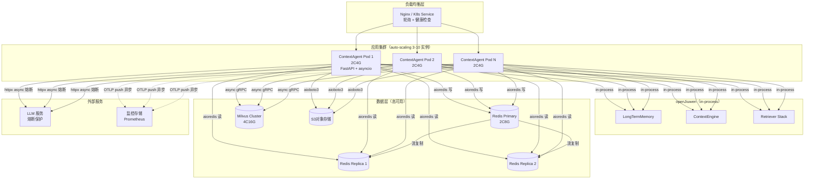

---

### 4.2 运维模型

#### 可观测性架构

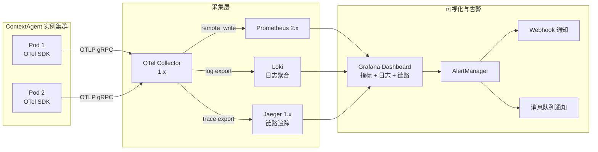

#### 日志规范

```json
{
  "timestamp": "2026-03-10T17:00:00.123Z",
  "level": "INFO",
  "trace_id": "abc123",
  "span_id": "def456",
  "scope_id": "scope_xxx",
  "user_id": "user_yyy",
  "uc_id": "UC002",
  "action": "tiered_recall",
  "duration_ms": 87,
  "status": "success",
  "tier_breakdown": {"hot_ms": 5, "warm_ms": 82},
  "degraded_sources": []
}
```

#### SLI/SLO 定义

| 指标 | SLI 定义 | SLO 目标 | 告警阈值（5分钟窗口） |
|------|----------|----------|---------------------|
| 召回可用性 | 成功召回请求数 / 总请求数 | 99.9% / 月 | < 99.5% 触发 P1 告警 |
| 关键路径时延 P95 | 第95百分位端到端时延 | ≤ 300ms | > 300ms 触发 P2 告警 |
| 热层时延 P95 | 热层召回第95百分位时延 | ≤ 20ms | > 50ms 触发 P2 告警 |
| 召回质量评分 | 综合质量评分（降级率+结果率） | ≥ 0.7 均值 | < 0.6 触发 P2 告警 |
| 错误率 | 5xx 响应数 / 总请求数 | < 0.1% | > 1% 触发 P1 告警 |
| 异步处理队列时延 | 从写入到处理完成的时延 P95 | ≤ 5s | > 10s 触发 P3 告警 |
| 降级率 | 含降级源的请求数 / 总请求数 | < 5% | > 20% 触发 P2 告警 |

#### 告警策略

| 级别 | 响应 SLA | 通知渠道 | 典型场景 |
|------|---------|----------|----------|
| P1（严重） | 5 分钟内响应 | Webhook（on-call）+ 消息队列 | 可用性 < 99.5%，错误率 > 1% |
| P2（警告） | 30 分钟内响应 | 消息队列 + 邮件 | P95 时延 > 300ms，质量评分 < 0.6 |
| P3（信息） | 工作时间内处理 | 邮件 / 日志 | 队列积压，降级率升高 |

#### 健康检查端点

```
GET /health/live   → 200 OK（进程存活）
GET /health/ready  → 200 OK（Redis + openJiuwen 初始化完成）
                  → 503 Service Unavailable（依赖未就绪）
GET /health/startup → 200 OK（启动完成，可接受流量）
```

#### 配置管理策略

- **静态配置**：通过环境变量注入（`REDIS_URL`、`VECTOR_DB_URL`、`LLM_API_KEY` 等），K8s ConfigMap + Secret 管理
- **动态热更新**：`ExposurePolicy`、`AlertConfig`、`HybridStrategyConfig` 存储于 Redis Hash，变更后发布 Redis Pub/Sub 通知各实例刷新本地缓存（延迟 < 100ms）
- **策略注册**：`CompressionStrategy` 通过 Python 注册表模式，服务启动时自动扫描 `strategies/` 目录加载

---

## 五、部署视图（Deployment View）

### 5.1 交付模型

#### 制品类型与命名规范

```
Container Registry: {registry}/context-agent/app:{semver}-{git-sha}
示例: registry.example.com/context-agent/app:1.2.0-a1b2c3d

Python 包（可选发布）: context-agent=={semver}
```

#### 制品清单

| 制品 | 类型 | 命名示例 | 包含内容 |
|------|------|----------|----------|
| ContextAgent 服务镜像 | Docker Image (amd64/arm64) | `registry/context-agent/app:1.0.0` | 应用代码、Python 3.11 运行时、依赖 |
| Helm Chart | `.tgz` | `context-agent-1.0.0.tgz` | K8s 资源模板、默认配置值 |
| Python 包 | `.whl` | `context_agent-1.0.0-py3-none-any.whl` | SDK 分发（嵌入式部署） |

#### 多环境配置分离策略

- 应用代码与配置严格分离：镜像不含任何环境特定配置
- 敏感信息（`LLM_API_KEY`、Redis 密码、AES 加密密钥）通过 K8s Secret 注入，不存储于镜像
- 非敏感配置通过 K8s ConfigMap 挂载为环境变量

#### 制品安全措施

- 镜像使用 Cosign 签名（Sigstore）
- CI/CD 中执行 `pip-audit` 依赖漏洞扫描（拦截 CVSS ≥ 7.0 的漏洞）
- 基础镜像使用 `python:3.11-slim`（最小化攻击面）
- 生产镜像以非 root 用户运行（`UID=1000`）

---

### 5.2 部署模型

#### 生产部署拓扑图

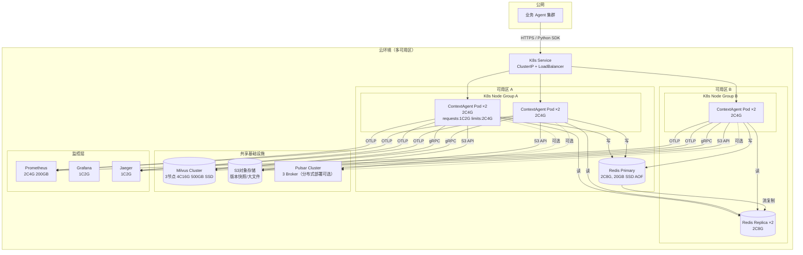

#### 各服务副本数与资源配额

| 服务 | 开发 | 预发 | 生产（稳态/峰值） | CPU Request/Limit | 内存 Request/Limit |
|------|------|------|------------------|-------------------|-------------------|
| ContextAgent | 1 | 2 | 3 / 10 | 1C / 2C | 2G / 4G |
| Redis | 1（单节点） | 1（持久化） | 3（1主2从） | 1C / 2C | 4G / 8G |
| Milvus（生产） | - | 1 | 3 节点 | 2C / 4C | 8G / 16G |
| Prometheus | 1 | 1 | 1（含 WAL 持久化） | 1C / 2C | 2G / 4G |

#### 存储配置

| 存储 | 类型 | 大小 | 挂载点 | 冗余 |
|------|------|------|--------|------|
| Redis AOF | PVC（SSD） | 20GB / 节点 | Redis 数据目录 | 主从流复制 |
| Milvus 数据 | PVC（SSD） | 500GB / 节点 | Milvus 数据目录 | 3副本 |
| S3 对象存储 | 对象存储服务 | 按需扩容 | MinIO/S3 Bucket | 云端内置冗余 |
| Prometheus TSDB | PVC（SSD） | 200GB | Prometheus 数据目录 | 单点（可扩展为 Thanos） |

#### 网络分区设计

```
公网 → K8s LoadBalancer (HTTPS 443) → K8s Service → ContextAgent Pod
         ↑ TLS 终止于 Ingress Controller

ContextAgent Pod → Redis（ClusterIP，内网） → 不暴露公网
ContextAgent Pod → Milvus（ClusterIP，内网） → 不暴露公网
ContextAgent Pod → LLM 服务（出向 HTTPS，经 Egress 策略限制目标域名）
```

#### 数据库迁移策略

- ContextVersionRecord、AlertConfig 等结构使用 Redis Hash，无 schema 迁移
- 工作记忆 schema 变更时，`WorkingNote.schema_version` 字段支持向后兼容读取
- 向量索引重建：Milvus Collection 使用版本化命名（`context_items_v2`），蓝绿切换后删除旧 Collection

#### 各环境配置矩阵

| 配置项 | 开发环境 | 预发环境 | 生产环境 |
|--------|----------|----------|----------|
| ContextAgent 副本 | 1 | 2 | 3-10（HPA） |
| Redis 模式 | 单节点（非持久化） | 单节点（AOF 持久化） | 主从（1主2从，Sentinel） |
| 向量库 | pgvector（本地进程） | pgvector（独立进程） | Milvus 集群（3节点） |
| 消息队列 | asyncio.Queue | asyncio.Queue | Pulsar 集群（3 Broker） |
| LLM 服务 | Mock（返回固定摘要） | 沙箱 API | 生产 API（熔断保护） |
| 日志级别 | DEBUG | INFO | WARN |
| 监控 | 本地 Prometheus（可选） | Prometheus + Grafana | Prometheus + Grafana + Jaeger |
| TLS | 关闭（本地） | 自签名证书 | CA 签名证书 |

---

## 六、架构决策记录（ADR）

### ADR-001：双模部署策略（嵌入式 vs 独立服务）

- **日期**：2026-03-10
- **状态**：已接受
- **背景**：ContextAgent 既可作为 Python 库嵌入业务 Agent 进程（零网络开销），也可作为独立 HTTP 服务（跨进程/跨语言调用）。不同团队有不同诉求。
- **决策**：同时支持两种部署模式：① **嵌入式**（pip install 直接 import，适合单进程 Agent）；② **独立服务**（FastAPI HTTP，适合多 Agent 共享一个 ContextAgent 实例）。通过 `ContextAPIRouter` 统一门面，两种模式暴露相同的接口签名。
- **备选方案**：
  - 方案 A（仅嵌入式）：零网络开销，但无法多 Agent 共享，无法跨语言调用；
  - 方案 B（仅独立服务）：增加网络跳，对轻量场景（单 Agent）引入不必要复杂度
- **后果**：
  - ✅ 灵活性最大，覆盖轻量和生产两种场景
  - ✅ `ContextAPIRouter` 作为门面，两种模式复用同一套核心逻辑
  - ⚠️ 需维护两套部署文档
  - 📌 注意：嵌入式模式下 asyncio 事件循环与业务 Agent 共享，需避免阻塞调用

---

### ADR-002：压缩策略注册表（Plugin Pattern）

- **日期**：2026-03-10
- **状态**：已接受
- **背景**：不同业务场景（问答/任务执行/长会话/高实时）需要不同压缩策略，且未来可能出现新场景。若硬编码策略选择，每次新增场景都需修改核心逻辑。
- **决策**：采用**注册表模式（Registry Pattern）**：定义 `CompressionStrategy` 抽象接口，各策略在启动时通过注册表注册；`CompressionStrategyRouter` 仅依赖注册表，不依赖具体实现类。新增策略只需实现接口并注册，无需修改路由逻辑。
- **备选方案**：
  - 方案 A（枚举 + if-else）：实现简单，但新增策略需修改 Router，违反开闭原则；
  - 方案 B（动态加载插件）：灵活性最大，但运行时加载增加复杂度和安全风险
- **后果**：
  - ✅ 符合开闭原则，新增场景不修改现有代码
  - ✅ openJiuwen 的四种压缩器（DialogueCompressor/RoundLevelCompressor/CurrentRoundCompressor/MessageSummaryOffloader）均可独立包装为策略
  - ⚠️ 需要维护注册表文档，避免策略 ID 冲突
  - 📌 策略注册在 `context_agent/__init__.py` 完成，确保所有策略在服务启动时已注册

---

### ADR-003：适配器层隔离 openJiuwen 内部 API

- **日期**：2026-03-10
- **状态**：已接受
- **背景**：ContextAgent 大量依赖 openJiuwen 的 `LongTermMemory`、`ContextEngine`、`Retriever` 等内部 API。若 openJiuwen 升级导致接口变更，将波及所有 ContextAgent 核心组件。
- **决策**：所有 openJiuwen 调用通过**适配器层（Adapter Layer）**进行封装：`LongTermMemoryAdapter`、`ContextEngineAdapter`、`RetrieverAdapter`。核心层和编排层只依赖 ContextAgent 自定义的适配器接口，不直接 import openJiuwen 内部模块。
- **备选方案**：
  - 方案 A（直接依赖）：代码最简单，但 openJiuwen 变更时修改范围不可控；
  - 方案 B（完全重实现）：彻底独立，但代价过高，放弃了 openJiuwen 大量原生能力
- **后果**：
  - ✅ openJiuwen 升级时只需修改适配器，核心逻辑零影响
  - ✅ 便于单元测试（Mock 适配器接口）
  - ⚠️ 增加一层间接调用，轻微性能开销（< 1μs，可忽略）
  - 📌 适配器内禁止添加业务逻辑，仅做参数转换和异常映射

---

### ADR-004：分层记忆热/温/冷三层架构

- **日期**：2026-03-10
- **状态**：已接受
- **背景**：openJiuwen `LongTermMemory` 提供统一记忆检索接口（`search_user_mem`），但所有类型记忆的检索时延相同（均走向量检索，P95 ≈ 100ms）。关键路径 SLA 为 P95 ≤ 300ms，热层（当前会话状态/变量）需要 < 20ms 响应。
- **决策**：在 openJiuwen 之上新增 `TieredMemoryRouter`，将记忆按访问频率和时效性分为三层：**热层**（Redis/内存 KV，< 20ms）、**温层**（openJiuwen LongTermMemory SUMMARY+EPISODIC，< 100ms）、**冷层**（外部知识库，< 300ms）。热层数据由 `AsyncMemoryProcessor` 在记忆处理完成后异步预热。
- **备选方案**：
  - 方案 A（统一检索）：架构简单，但无法满足热层 < 20ms SLA；
  - 方案 B（完全替换 openJiuwen 记忆）：性能可控，但丧失 openJiuwen 记忆处理（去重/冲突检测）能力
- **后果**：
  - ✅ 热层可稳定满足 < 20ms，关键路径总体 P95 ≤ 300ms 可达
  - ✅ 分层降级策略明确，各层独立可用
  - ⚠️ 热层与 openJiuwen LTM 之间存在短暂数据不一致（异步预热延迟 < 5s）
  - 📌 热层仅缓存高频读取数据（VARIABLE 类型），不缓存 SEMANTIC/EPISODIC（防止热层过大）

---

### ADR-005：异步记忆处理与主链路解耦

- **日期**：2026-03-10
- **状态**：已接受
- **背景**：记忆去重/冲突检测（`MemUpdateChecker`）需调用 LLM，P95 ≈ 500ms，若在主链路同步执行，将使写入延迟从 < 10ms 增加到 > 500ms，严重影响业务 Agent 的调用体验。
- **决策**：`LongTermMemory.add_messages` 写入完成后立即返回；`AsyncMemoryProcessor` 通过 asyncio.Queue 异步消费处理任务，与主链路完全解耦。处理完成后发布 `MEMORY_UPDATED` 内部事件，刷新上下文缓存并（可选）通知业务 Agent。分布式部署时 Queue 升级为 Pulsar Topic。
- **备选方案**：
  - 方案 A（同步处理）：数据一致性最高，但主链路延迟增加 > 500ms，不可接受；
  - 方案 B（批量定时处理）：延迟可能达分钟级，记忆更新不够及时
- **后果**：
  - ✅ 主链路写入延迟 < 10ms 额外开销，符合 SLA
  - ✅ 处理失败不影响原始数据（写入已成功）
  - ⚠️ 记忆处理存在最终一致性延迟（P95 < 5s）
  - 📌 asyncio.Queue 单点风险：服务重启时未处理任务丢失；生产环境应切换 Pulsar 持久化队列

---

## 七、横切关注点（Cross-Cutting Concerns）

### 7.1 安全架构

#### 认证与授权

- **认证**：ContextAgent 不实现独立认证，依赖调用方（业务 Agent）提供有效的 `scope_id` + `user_id`；HTTP API 模式下通过 Bearer Token（JWT）校验，验证 token 中的 `scope_id` 声明
- **授权**：基于 `scope_id` 的数据隔离（所有存储操作均携带 `scope_id` 过滤），跨 `scope_id` 请求返回 403
- **服务间信任**：嵌入式模式下 in-process 调用无网络鉴权；独立服务模式下服务间通信通过 mTLS

#### 数据加密

- **传输加密**：HTTP API 强制 TLS 1.2+；内部服务（Redis、Milvus）通过 VPC 内网通信
- **存储加密**：敏感记忆字段（对话历史、用户偏好）使用 AES-256 加密（复用 openJiuwen `MemoryEngineConfig.crypto_key`，密钥长度 32 字节）；版本快照加密存储于对象存储；Redis 中的 WorkingNote 加密存储
- **密钥管理**：加密密钥通过 K8s Secret 注入，不存储于代码或配置文件

#### 敏感数据处理

- 日志中不记录原始上下文内容，仅记录 item_id、操作类型和元数据
- `ExposurePolicy` 的 `state_only_fields` 机制防止内部状态泄露给外部模型调用
- 监控指标不含用户数据，仅含聚合数值和标签

#### 安全扫描

- CI 流水线中执行 `pip-audit`（依赖漏洞，CVSS ≥ 7.0 阻断构建）和 `bandit`（代码安全检查）
- 镜像使用 Trivy 扫描（高危漏洞阻断发布）

---

### 7.2 错误处理规范

#### 错误码体系

```
格式：CA-{模块代码}-{错误类型}
模块代码：AGG（聚合）、MEM（记忆）、CTX（上下文）、RET（检索）、COMP（压缩）、MON（监控）
错误类型：001-099 业务错误，100-199 依赖错误，200-299 系统错误

示例：
CA-MEM-001  记忆检索超时（降级处理，不报错）
CA-MEM-100  LongTermMemory 不可用（依赖错误）
CA-CTX-001  context_id 不存在
CA-CTX-002  scope_id 与 context_id 不匹配（403）
CA-RET-001  引用类型不支持（RefResolutionError）
CA-COMP-001 压缩失败（原上下文保持不变）
```

#### HTTP 状态码映射

| 场景 | HTTP 状态码 | 错误码示例 |
|------|-------------|-----------|
| scope_id/user_id 鉴权失败 | 401 | CA-SYS-401 |
| 跨 scope_id 访问 | 403 | CA-CTX-002 |
| 资源不存在 | 404 | CA-CTX-001 |
| 输入参数校验失败 | 422 | CA-SYS-422 |
| 下游服务超时（降级成功） | 200（含 degraded 标注） | - |
| 下游服务不可用（无法降级） | 503 | CA-MEM-100 |
| 内部错误 | 500 | CA-SYS-500 |

#### 重试策略

```python
# 外部存储重试（指数退避）
RETRY_CONFIG = {
    "max_attempts": 3,
    "initial_delay_ms": 100,
    "backoff_multiplier": 2,      # 100ms → 200ms → 400ms
    "max_delay_ms": 2000,
    "retryable_exceptions": [ConnectionError, TimeoutError],
}

# LLM 服务：不重试（熔断后立即降级），避免级联延迟
# 异步处理队列任务：最多重试 3 次，退避后进入死信队列
```

#### 幂等设计

- `write_note(scope_id, session_id, note_type, content)`：相同 `(scope_id, session_id, note_type)` 覆盖写入，幂等
- `create_snapshot(context_id, label)`：相同 label 不重复创建，返回已有版本 ID
- `inject_note(context_id, note_keys)`：相同 note_key 重复注入不产生重复内容（基于 item_id 去重）

---

### 7.3 API 设计规范

#### 版本策略

- Python SDK：语义化版本（semver），次版本号升级向后兼容，主版本号升级提前 3 个月通知
- HTTP API：URL 版本前缀（`/api/v1/`），不使用 Header 版本（便于日志和缓存区分）

#### 分页规范

- 分页接口（如 `get_metrics`、`list_versions`）使用 **cursor-based 分页**：
  ```json
  { "items": [...], "cursor": "eyJ0aW1lc3RhbXAiOiAiMjAyNi0wMy0xMCJ9", "has_more": true }
  ```
- 页大小默认 20，最大 100；超出最大值返回 422

#### 幂等键设计

- 写操作支持 `X-Idempotency-Key` Header（UUID），服务端基于 Redis 缓存 24h 内的幂等结果
- SDK 调用通过 `idempotency_key` 参数传入

---

## 附录

### A. 术语表

| 术语 | 定义 |
|------|------|
| ContextAgent | 本系统，多 Agent 系统中的上下文管理中枢 |
| 业务 Agent | 调用 ContextAgent 的上层 Agent |
| scope_id | 租户/场景隔离键，所有数据按此键隔离 |
| ContextSnapshot | 多源上下文聚合的瞬态结果对象 |
| ContextRef | 轻量引用，指向可按需拉取的上下文内容 |
| ContextView | 经暴露控制策略过滤后的上下文视图 |
| ExposurePolicy | 上下文暴露控制规则，定义哪些字段可注入模型调用 |
| WorkingNote | 结构化工作记忆，持久化到上下文窗口外 |
| HandoffSummary | 子任务交接摘要，从主 Agent 上下文提取子任务相关背景 |
| TieredMemoryRouter | 热/温/冷三层记忆调度路由组件 |
| HotTierCache | 热层缓存（Redis/内存 KV），P95 < 20ms |
| CompressionStrategy | 可插拔压缩策略抽象接口 |
| Compaction | 接近 token 上限时的高保真上下文压缩，保留关键决策/约束/未决问题 |
| openJiuwen | 基础框架（Python SDK），提供 LongTermMemory/ContextEngine/Retriever 等原生能力 |
| JIT Retrieval | Just-in-time 即时上下文检索，运行时按需拉取轻量引用指向的内容 |
| ADR | Architecture Decision Record，架构决策记录 |

### B. 参考资料

- openJiuwen Core 文档：https://gitcode.com/openJiuwen/agent-core
- ContextAgent 需求分析文档：`docs/requirements-analysis.md`
- Kruchten 4+1 视图方法论：《Architectural Blueprints—The "4+1" View Model of Software Architecture》
- Anthropic Context Engineering 实践：https://www.anthropic.com/engineering/context-engineering

### C. 变更历史

| 版本 | 日期 | 作者 | 变更说明 |
|------|------|------|----------|
| v1.0 | 2026-03-10 | ContextAgent 架构团队 | 初始版本，涵盖 4+1 视图全量内容 |
| v1.1 | 2026-03-11 | ContextAgent 架构团队 | 新增 OpenViking 借鉴能力（见附录 D） |

### D. OpenViking 借鉴能力（v1.1 新增）

本版本从 volcengine/OpenViking 借鉴了 5 项差异化能力，充分复用 openJiuwen 框架原生接口（`AgenticRetriever`、`rrf_fusion`），最小化自研范围：

#### D.1 Hotness Score（热度评分）

**文件：** `context_agent/core/memory/hotness.py`

```
hotness = sigmoid(log1p(active_count)) × exp(-λ × age_days)   λ = ln(2)/half_life_days
```

- `active_count` 由 `POST /context/used` 反馈累加
- 以 `HOTNESS_ALPHA=0.2` 权重混入 `SearchCoordinator._rrf_fuse()` 的 RRF 分数
- 使高频确认有用的上下文在后续检索中排名更高

#### D.2 used() 上下文使用反馈 API

**新增端点：** `POST /context/used`  
**新增方法：** `WorkingMemoryManager.mark_used()`、`TieredMemoryRouter.record_usage()`

业务 Agent 在 LLM 响应后上报哪些上下文 item_id 被实际使用，驱动 Hotness Score 数据管道。

#### D.3 ContextItem 语义分类（6 分类 MemoryCategory）

**文件：** `context_agent/models/context.py`  
**新增字段：** `ContextItem.category: MemoryCategory | None`

| 分类 | 语义 |
|------|------|
| `profile` | 稳定身份属性（姓名、角色、时区） |
| `preferences` | 风格/格式/语言偏好 |
| `entities` | 用户关注的命名实体 |
| `events` | 时序事件，追加式 |
| `cases` | 问题+解决方案对，追加式 |
| `patterns` | 可复用任务模式 |

`AggregationRequest.category_filter` 支持按分类过滤注入的上下文。

#### D.4 L0/L1/L2 分层上下文（渐进式展开）

**文件：** `context_agent/models/context.py`（`ContextLevel` 枚举）  
**新增字段：** `ContextItem.level: ContextLevel`

| 层级 | Token 限制 | 用途 |
|------|-----------|------|
| ABSTRACT | ~100 | 向量搜索、快速过滤 |
| OVERVIEW | ~2k | Rerank 精排、导航 |
| DETAIL | 无限制 | 完整内容，按需加载 |

`AggregationRequest.max_level` 控制最大注入层级，等同 budget 允许时才展开更高层级。

#### D.5 fast/quality 双路径检索

**文件：** `context_agent/orchestration/context_aggregator.py`  
**新增参数：** `AggregationRequest.mode: "fast" | "quality"`

| 路径 | 延迟 | 机制 |
|------|------|------|
| `fast`（默认） | 低 | `HybridRetriever` 并发检索 |
| `quality` | 较高 | `AgenticRetriever`（openJiuwen 原生）LLM 驱动检索 |

**关键决策：** quality 路径直接使用 openJiuwen `AgenticRetriever`，无需自研 IntentAnalyzer，符合"最大化复用框架能力"约束。

#### D.6 工具性能记忆

**新增方法：** `ToolContextGovernor.record_tool_result()`  
**新增端点：** `POST /tools/result`

累积工具调用成功率（`tool_stats.success_time / call_time`），低成功率工具在 `select_tools()` 中排名靠后。


---

## 附录 E：OpenClaw 集成架构（context-engine 插件体系）

### E.1 概述

OpenClaw 3.8（PR #22201，2026-03-06 合并）引入了 **context-engine 插件槽**，允许第三方服务替换其内置的 Pi legacy 上下文管理器。ContextAgent 通过此机制以 **HTTP 代理**形式接管 OpenClaw 的全部上下文生命周期。

参考实现：`Martian-Engineering/lossless-claw`（第一个真实 context-engine 插件）

---

### E.2 集成架构图

```
┌─────────────────────────────────────────────────────┐
│                  OpenClaw 3.8                        │
│  ┌───────────────────────────────────────────────┐  │
│  │           attempt.ts（每轮对话）               │  │
│  │  hadSession → bootstrap()                     │  │
│  │  pipeline  → assemble()   ← inject context    │  │
│  │  LLM call                                     │  │
│  │  afterTurn → afterTurn()  ← Hotness feedback  │  │
│  │  overflow  → compact()    ← compress          │  │
│  │  finally   → dispose()                        │  │
│  └──────────────┬────────────────────────────────┘  │
│                 │ ContextEngine interface             │
│  ┌──────────────▼────────────────────────────────┐  │
│  │  ContextAgentEngine (TypeScript)               │  │
│  │  plugins/context-agent/src/engine.ts         │  │
│  └──────────────┬────────────────────────────────┘  │
│                 │ HTTP fetch (Node.js ≥18)            │
└─────────────────┼───────────────────────────────────┘
                  │
     ┌────────────▼─────────────────────────────────┐
     │       ContextAgent HTTP Service (Python)       │
     │  POST /v1/openclaw/bootstrap                   │
     │  POST /v1/openclaw/ingest                      │
     │  POST /v1/openclaw/assemble  ◄── 核心路径      │
     │  POST /v1/openclaw/compact                     │
     │  POST /v1/openclaw/after-turn                  │
     │                                                │
     │  context_agent/api/openclaw_handler.py         │
     │  context_agent/api/openclaw_schemas.py         │
     └────────────┬─────────────────────────────────┘
                  │
     ┌────────────▼─────────────────────────────────┐
     │         ContextAPIRouter (现有管道)            │
     │  TieredMemoryRouter + WorkingMemoryManager    │
     │  HybridRetriever / AgenticRetriever           │
     │  CompressionStrategyRouter                    │
     │  Hotness Score (active_count feedback)        │
     └──────────────────────────────────────────────┘
```

---

### E.3 生命周期调用链

| OpenClaw 调用点 | 触发条件 | ContextAgent 动作 | 端点 |
|----------------|---------|-----------------|------|
| `bootstrap()` | `hadSessionFile=true`（已有会话） | 预热缓存，导入历史消息 | `/bootstrap` |
| `assemble()` | 每轮 LLM 调用前 | 检索相关上下文 → `systemPromptAddition` | `/assemble` |
| `afterTurn()` | 每轮完成后 | Hotness 反馈 + 持久化 assistant 回复 | `/after-turn` |
| `compact()` | token 溢出（overflow safety net） | 压缩策略管道 | `/compact` |
| `dispose()` | run 结束 finally 块 | 清理状态 | —（无网络调用） |

---

### E.4 assemble() 注入策略（Mode B）

ContextAgent 使用 **Mode B** — 注入模式（区别于 lossless-claw 的 Mode A 消息替换）：

```
assemble() 返回：
  messages:               原始消息列表（不修改）
  systemPromptAddition:   "# Relevant Context\n\n{retrieved_context}"
```

OpenClaw 将 `systemPromptAddition` **prepend** 到 system prompt 头部，模型以此感知历史上下文。

---

### E.5 ownsCompaction 标志

`ContextAgentEngine.getInfo()` 返回 `{ ownsCompaction: true }`，通知 OpenClaw 跳过内置 Pi 自动压缩。Token 溢出 overflow safety net（`compact()`）始终激活，与此标志无关。

---

### E.6 插件包结构

```
plugins/context-agent/
├── index.ts                   # 插件入口，export default plugin
├── src/
│   ├── engine.ts              # ContextAgentEngine implements ContextEngine
│   ├── client.ts              # HTTP fetch 封装（超时/重试/Bearer 认证）
│   └── config.ts              # parseConfig()
├── openclaw.plugin.json       # 插件 manifest（无 kind 字段）
├── package.json               # type:module, openclaw.extensions:["./index.ts"]
├── tsconfig.json
└── README.md
```

**关键决策：OpenClaw 直接加载 TypeScript 源码**，无需预编译。插件通过 `package.json` 中的 `"openclaw": { "extensions": ["./index.ts"] }` 发现。

---

### E.7 Python Bridge 新增文件

| 文件 | 说明 |
|------|------|
| `context_agent/api/openclaw_schemas.py` | 5 对 Pydantic request/response schema（`AgentMessage` + `Bootstrap/Ingest/Assemble/Compact/AfterTurn`） |
| `context_agent/api/openclaw_handler.py` | FastAPI `APIRouter`，挂载于 `/v1/openclaw`，5 个端点实现 |
| `context_agent/api/http_handler.py` | 新增 `app.include_router(openclaw_router)` |
| `context_agent/models/context.py` | `ContextOutput` 新增 `metadata: dict` 字段（用于 item_ids 透传） |

---

### E.8 scope_id / session_id 映射

| OpenClaw 概念 | ContextAgent 字段 | 推荐值 |
|--------------|-----------------|-------|
| 逻辑命名空间 | `scope_id` | 插件 config 中 `scopeId`（默认 `"openclaw"`，建议按 channel 设置） |
| 会话标识 | `session_id` | OpenClaw 传入的 `sessionId` |
