# ContextAgent 需求分析说明书

| 字段 | 内容 |
|------|------|
| 项目名称 | ContextAgent |
| 文档版本 | v1.0 |
| 文档受众 | 架构师、开发团队、测试团队 |
| 主 Actor | 业务 Agent（调用 ContextAgent 的上层 Agent） |
| 基础框架 | openJiuwen Core（`openjiuwen` Python SDK） |
| 系统边界原则 | openJiuwen 原生能力优先复用；ContextAgent 负责增强或补足不支持的能力 |

---

## 一、功能性需求

---

### UC001 — 多源上下文聚合

| 字段 | 内容 |
|------|------|
| **用例名称** | UC001 — 多源上下文聚合 |
| **用例描述** | 业务 Agent 发起聚合请求，ContextAgent 并行从多类上下文源（对话历史、用户偏好、长期记忆、任务状态、外部知识/工具返回结果）中拉取数据，经去重、格式化后返回统一的 `ContextSnapshot` 对象。 |
| **Actor** | 主 Actor：业务 Agent   辅助 Actor：openJiuwen `LongTermMemory`、外部存储系统（向量数据库、图数据库、文档库） |
| **前置条件** | 1. ContextAgent 服务已启动并完成初始化   2. `scope_id` 和 `user_id` 已由业务 Agent 提供   3. `LongTermMemory` 已完成 `register_store` 并绑定对应 KV/向量存储 |
| **最小保证** | 返回空 `ContextSnapshot`（所有来源均不可用时）或仅包含已成功拉取来源数据的部分快照，并在响应中标注降级来源列表 |
| **成功保证** | 返回完整 `ContextSnapshot`，包含业务 Agent 请求的全部上下文类型；每条数据标注来源、类型和时间戳 |
| **触发事件** | 业务 Agent 调用 `ContextAgent.aggregate(scope_id, user_id, sources, options)` 接口 |

**主成功场景**

> P1. 业务 Agent 调用聚合接口，携带 `scope_id`、`user_id`、`sources`（所需上下文类型列表）和 `options`（含时延预算）
> P2. ContextAgent 解析 `sources`，将请求路由到各对应处理器
> P3. ContextAgent 并行执行：
> &nbsp;&nbsp;&nbsp;P3a. 调用 `LongTermMemory.get_recent_messages` 拉取对话历史
> &nbsp;&nbsp;&nbsp;P3b. 调用 `LongTermMemory.search_user_mem(search_type="user_profile")` 拉取用户偏好
> &nbsp;&nbsp;&nbsp;P3c. 调用 `LongTermMemory.search_user_mem(search_type="semantic_memory"/"episodic_memory")` 拉取长期记忆
> &nbsp;&nbsp;&nbsp;P3d. 调用 `LongTermMemory.get_variables` 拉取任务状态变量
> &nbsp;&nbsp;&nbsp;P3e. 调用外部存储适配器（`ExternalMemoryAdapter`）拉取外部知识和工具返回结果缓存
> P4. ContextAgent 对各来源结果进行去重、冲突标注和格式化，统一封装为 `ContextSnapshot`
> P5. ContextAgent 将 `ContextSnapshot` 返回业务 Agent

**扩展场景**

> **3a.** 某上下文源响应超时（超过 options 中指定的单源时延预算）
> &nbsp;&nbsp;&nbsp;3a1. ContextAgent 记录该源超时，将其标注为降级源（`degraded_sources`）
> &nbsp;&nbsp;&nbsp;3a2. ContextAgent 继续聚合其他来源的结果，不阻塞整体返回
> &nbsp;&nbsp;&nbsp;3a3. 返回 P4，在 `ContextSnapshot.metadata.degraded_sources` 中列出超时源

> **3b.** 外部存储适配器认证失败或不可用
> &nbsp;&nbsp;&nbsp;3b1. ContextAgent 记录连接失败，将外部源标注为 `unavailable`
> &nbsp;&nbsp;&nbsp;3b2. 返回仅含 openJiuwen 内部源的部分 `ContextSnapshot`

> **2a.** `sources` 包含系统不支持的上下文类型
> &nbsp;&nbsp;&nbsp;2a1. ContextAgent 返回错误，列出不支持的类型；其余合法来源正常处理

**非功能属性**

| 类别 | 要求 |
|------|------|
| 性能 | 聚合接口 P95 < 200ms（仅 openJiuwen 内部源）；含外部源时 P95 < 300ms；支持单 ContextAgent 实例 100 并发聚合请求 |
| 可靠性 | 单源失败不影响整体聚合（部分成功降级）；外部源调用失败重试 1 次后标记降级 |
| 安全 | `scope_id`/`user_id` 鉴权验证；ContextSnapshot 中敏感字段（如用户偏好）传输加密（复用 openJiuwen `MemoryEngineConfig.crypto_key` AES-256） |
| 可测试性 | `ExternalMemoryAdapter` 提供 Mock 接口；`sources` 参数可独立测试单一来源；`ContextSnapshot` 结构可序列化，便于断言 |

**架构影响**

新增 `ContextAggregator` 服务类，编排并行多源拉取逻辑；新增 `ExternalMemoryAdapter` 抽象层，屏蔽外部存储差异（实现：向量数据库、图数据库、文档库适配器）；新增 `ContextSnapshot` 数据模型（含 `items: List[ContextItem]`、`metadata: AggregationMetadata`）；复用 openJiuwen `LongTermMemory` 的五类记忆检索接口（`search_user_mem`、`get_recent_messages`、`get_variables`）。不引入新存储，不影响现有 openJiuwen 记忆写入路径。

**UML 活动图**

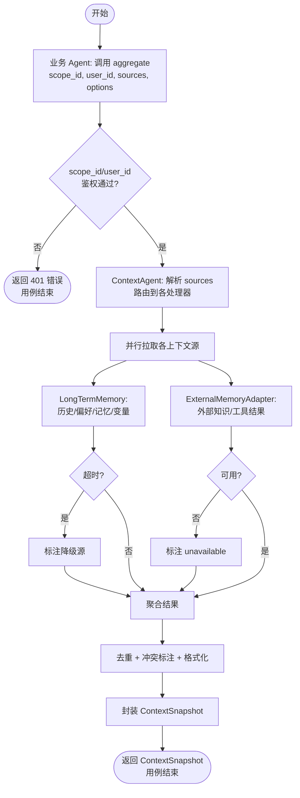

---

### UC002 — 分层分级记忆管理

| 字段 | 内容 |
|------|------|
| **用例名称** | UC002 — 分层分级记忆管理 |
| **用例描述** | 业务 Agent 提交记忆检索请求，ContextAgent 根据时延预算、任务类型和记忆热度，按热/温/冷三层分级调度召回路径，在满足时延约束的前提下最大化召回质量。 |
| **Actor** | 主 Actor：业务 Agent   辅助 Actor：openJiuwen `LongTermMemory`（温/冷层）、Session 缓存（热层）、外部存储（冷层） |
| **前置条件** | 1. ContextAgent 已完成分层配置（热/温/冷层存储绑定）   2. `scope_id`、`user_id` 和 `latency_budget_ms` 已由请求携带 |
| **最小保证** | 热层始终在 20ms 内返回结果（即使为空）；温/冷层失败时热层结果仍可返回 |
| **成功保证** | 在 `latency_budget_ms` 内按层级顺序召回，返回分层标注的记忆列表（`tier: hot/warm/cold`） |
| **触发事件** | 业务 Agent 调用 `ContextAgent.retrieve_memory(scope_id, user_id, query, latency_budget_ms, task_type)` |

**主成功场景**

> P1. 业务 Agent 调用记忆检索接口，携带查询内容、`latency_budget_ms`（如 200ms）和 `task_type`
> P2. `TieredMemoryRouter` 根据 `latency_budget_ms` 和 `task_type` 制定召回计划：分配各层时延配额
> P3. 执行热层召回（P95 < 20ms）：查询 Session 缓存中的当前会话状态、近期变量（复用 `LongTermMemory.get_variables` 及 in-memory KV）
> P4. 若热层未满足 `top_k` 且剩余时延充足，执行温层召回（P95 < 100ms）：调用 `LongTermMemory.search_user_mem`（SUMMARY + EPISODIC 类型）
> P5. 若仍未满足且剩余时延充足，执行冷层召回（P95 < 300ms）：通过 `ExternalMemoryAdapter` 查询外部知识库或图数据库
> P6. 合并各层结果，按 `score` 降序排列，标注每条记忆的层级（`tier`）
> P7. 返回分层标注的记忆列表

**扩展场景**

> **2a.** `latency_budget_ms` < 30ms（极低时延预算）
> &nbsp;&nbsp;&nbsp;2a1. `TieredMemoryRouter` 仅调度热层召回，跳过温/冷层
> &nbsp;&nbsp;&nbsp;2a2. 返回 P6

> **4a.** 温层召回耗时超过分配配额
> &nbsp;&nbsp;&nbsp;4a1. 中止温层请求，记录超时指标（上报 UC016 监控）
> &nbsp;&nbsp;&nbsp;4a2. 标注温层为 `timeout`，跳过冷层（若总时延已达预算）
> &nbsp;&nbsp;&nbsp;4a3. 返回 P6

> **3a.** 热层缓存冷启动（首次请求，缓存为空）
> &nbsp;&nbsp;&nbsp;3a1. 热层返回空，直接进入温层召回

**非功能属性**

| 类别 | 要求 |
|------|------|
| 性能 | 热层 P95 < 20ms；温层 P95 < 100ms；冷层 P95 < 300ms；总体 P95 ≤ `latency_budget_ms` |
| 可靠性 | 各层独立降级，互不阻塞；温/冷层超时后热层结果正常返回 |
| 安全 | 跨 `scope_id` 的记忆隔离（复用 openJiuwen `scope_id` 机制）；热层缓存数据加密存储 |
| 可测试性 | `TieredMemoryRouter` 可注入 mock 时钟以测试超时路径；各层返回结果含 `tier` 字段，便于断言层级路由正确性 |

**架构影响**

新增 `TieredMemoryRouter` 类：接收 `latency_budget_ms` 和 `task_type`，输出各层时延配额和调度计划；新增 `HotTierCache` 组件（基于 in-memory KV 或 Redis，复用 openJiuwen `extensions/store/kv/redis_store.py`）；温/冷层复用 `LongTermMemory.search_user_mem` 和 `ExternalMemoryAdapter`；`ContextItem` 模型新增 `tier: Literal["hot","warm","cold"]` 字段。不修改 openJiuwen 记忆写入路径。

**UML 活动图**

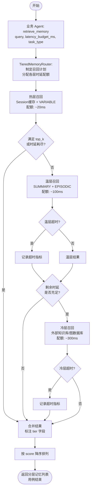

---

### UC003 — 动态上下文更新与管理

| 字段 | 内容 |
|------|------|
| **用例名称** | UC003 — 动态上下文更新与管理 |
| **用例描述** | 在多轮对话过程中，ContextAgent 持续监控上下文健康度（token 使用量、失效模式），并在触发条件满足时动态执行裁剪、压缩、更新或隔离操作，维持上下文窗口的相关性、精炼性和一致性。 |
| **Actor** | 主 Actor：业务 Agent   辅助 Actor：openJiuwen `ContextEngine`、`MemUpdateChecker` |
| **前置条件** | 1. 业务 Agent 已建立 ContextEngine 上下文（`context_id` 已创建）   2. token 预算阈值已在配置中设定 |
| **最小保证** | 检测到失效模式时，至少将问题上下文片段标注为 `flagged`，不静默忽略；上下文始终保持可用状态（不因管理操作导致上下文丢失） |
| **成功保证** | 上下文健康度评分满足阈值；token 使用量控制在预算内；上下文中不含已检测的 poisoning/distraction/confusion/clash 片段（已隔离或压缩处理） |
| **触发事件** | 任一条件触发：① 每轮对话结束后自动检查；② token 使用量超过配置阈值（如 80%）；③ `MemUpdateChecker` 检测到冲突记忆；④ 业务 Agent 显式调用 `ContextAgent.manage_context(context_id, action)` |

**主成功场景**

> P1. 触发条件满足，ContextAgent 启动上下文健康检查流程
> P2. ContextAgent 调用 `ContextEngine.get_context(context_id)` 获取当前上下文
> P3. `ContextHealthChecker` 执行健康度评估：
> &nbsp;&nbsp;&nbsp;P3a. 计算当前 token 使用量（复用 `tiktoken_counter`），判断是否超过预算阈值
> &nbsp;&nbsp;&nbsp;P3b. 调用 `MemUpdateChecker` 检测记忆冗余（REDUNDANT）和冲突（CONFLICTING）
> &nbsp;&nbsp;&nbsp;P3c. 评估上下文相关性衰减（基于时间戳和引用频次）
> P4. 根据健康评估结果，选择处理动作：
> &nbsp;&nbsp;&nbsp;P4a. 若 token 超阈值 → 路由到 UC009（压缩/摘要）
> &nbsp;&nbsp;&nbsp;P4b. 若检测到 CONFLICTING 片段 → 隔离冲突片段，标注 `clash`，通知业务 Agent
> &nbsp;&nbsp;&nbsp;P4c. 若检测到 REDUNDANT 片段 → 合并或删除，更新上下文
> &nbsp;&nbsp;&nbsp;P4d. 若检测到低相关性片段 → 标注 `low_relevance`，候选压缩
> P5. ContextAgent 更新 `ContextEngine` 中的上下文状态（`save_contexts`）
> P6. 返回健康检查报告（`ContextHealthReport`）给业务 Agent

**扩展场景**

> **3b.** `MemUpdateChecker` 调用 LLM 超时
> &nbsp;&nbsp;&nbsp;3b1. 跳过 LLM 冲突检测，基于关键词/规则执行轻量冲突检测
> &nbsp;&nbsp;&nbsp;3b2. 上报检测降级日志，返回 P4

> **4b.** 冲突片段涉及多轮核心推理链，无法安全隔离
> &nbsp;&nbsp;&nbsp;4b1. 标注冲突但不隔离，在 `ContextHealthReport` 中标记 `requires_human_review: true`
> &nbsp;&nbsp;&nbsp;4b2. 通知业务 Agent 冲突需人工或上层决策处理

> **1a.** 业务 Agent 显式调用 `manage_context` 并指定 `action=force_compress`
> &nbsp;&nbsp;&nbsp;1a1. 跳过健康评估，直接执行 UC009 压缩流程

**非功能属性**

| 类别 | 要求 |
|------|------|
| 性能 | 健康检查（不含 LLM）P95 < 50ms；含 LLM 冲突检测时 P95 < 500ms（异步执行，不阻塞主链路） |
| 可靠性 | 健康检查失败不影响业务 Agent 正常调用；失败时上下文保持上次健康状态 |
| 安全 | 健康报告中不暴露原始上下文内容，仅暴露片段 ID 和标注类型 |
| 可测试性 | `ContextHealthChecker` 可注入 mock `MemUpdateChecker`；四类失效模式（poisoning/distraction/confusion/clash）各有独立测试用例和可观测输出 |

**架构影响**

新增 `ContextHealthChecker` 类，封装四类失效模式检测逻辑（context poisoning、distraction、confusion、clash）；复用 openJiuwen `MemUpdateChecker`（`openjiuwen.core.memory.manage.update`）进行记忆冲突/冗余检测；复用 `ContextEngine.get_context`/`save_contexts` 读写上下文状态；复用 `tiktoken_counter` 计算 token 使用量；新增 `ContextHealthReport` 数据模型；健康检查流程以异步后台任务执行，不阻塞主链路。

**UML 活动图**

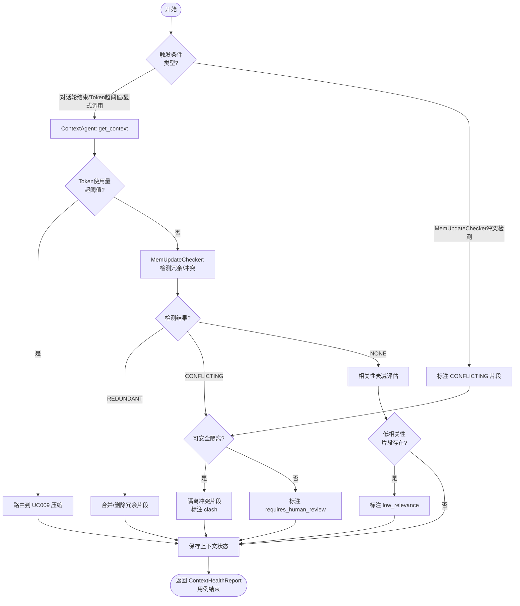

---

### UC004 — 即时上下文检索（JIT Retrieval）

| 字段 | 内容 |
|------|------|
| **用例名称** | UC004 — 即时上下文检索（JIT Retrieval） |
| **用例描述** | 业务 Agent 在推理过程中携带轻量引用（文件路径、对象 ID、查询模板等），按需触发 ContextAgent 的即时检索，拉取高价值上下文并注入，避免推理前一次性加载所有候选信息。 |
| **Actor** | 主 Actor：业务 Agent   辅助 Actor：openJiuwen `AgenticRetriever`、`LongTermMemory`、工作记忆存储、外部工具系统 |
| **前置条件** | 1. 业务 Agent 已持有轻量引用（`ContextRef` 对象，含引用类型和定位信息）   2. 对应数据源已在 ContextAgent 中注册 |
| **最小保证** | 引用无法解析时返回 `RefResolutionError`（含引用类型和失败原因），不静默返回空内容 |
| **成功保证** | 返回与引用对应的上下文内容，并注入业务 Agent 的当前活跃上下文 |
| **触发事件** | 业务 Agent 在推理中调用 `ContextAgent.fetch(ref: ContextRef, inject_to: context_id)` |

**主成功场景**

> P1. 业务 Agent 在推理过程中识别到需要更多上下文，调用 `ContextAgent.fetch(ref, inject_to)`
> P2. ContextAgent 的 `JITResolver` 解析 `ContextRef`，识别引用类型：
> &nbsp;&nbsp;&nbsp;`VECTOR_REF`（向量候选 ID）→ 路由到 `AgenticRetriever`（复用 openJiuwen）
> &nbsp;&nbsp;&nbsp;`GRAPH_REF`（图节点/边 ID）→ 路由到 `AgenticRetriever`（graph 模式）
> &nbsp;&nbsp;&nbsp;`MEMORY_REF`（LTM 记忆 ID）→ 调用 `LongTermMemory.get_message_by_id`
> &nbsp;&nbsp;&nbsp;`SCRATCHPAD_REF`（工作记忆键名）→ 路由到 UC010 工作记忆读取接口
> &nbsp;&nbsp;&nbsp;`TOOL_RESULT_REF`（工具调用结果指针）→ 从工具结果缓存检索
> P3. 对应检索器执行检索，返回内容
> P4. ContextAgent 对内容进行 token 预算校验（不超过 `inject_to` 上下文剩余配额）
> P5. ContextAgent 调用 `ContextEngine` 将内容注入 `inject_to` 指定的上下文
> P6. 返回注入确认（`FetchResult`，含注入内容摘要和 token 消耗量）

**扩展场景**

> **2a.** `ContextRef` 引用类型未知或未注册
> &nbsp;&nbsp;&nbsp;2a1. `JITResolver` 返回 `RefResolutionError(type="UNKNOWN_REF_TYPE")`，用例结束

> **4a.** 检索到的内容超过 `inject_to` 上下文剩余 token 配额
> &nbsp;&nbsp;&nbsp;4a1. ContextAgent 触发内容截断策略（保留最相关部分）
> &nbsp;&nbsp;&nbsp;4a2. 在 `FetchResult` 中标注 `truncated: true` 和原始 token 数量

> **3a.** `AgenticRetriever` 迭代检索超过最大轮次（如 5 轮）
> &nbsp;&nbsp;&nbsp;3a1. 返回已检索到的最优内容，标注 `max_iterations_reached: true`

**非功能属性**

| 类别 | 要求 |
|------|------|
| 性能 | `MEMORY_REF`/`SCRATCHPAD_REF` 类型 P95 < 30ms；`VECTOR_REF`/`GRAPH_REF` 类型 P95 < 150ms；整体 fetch 链路 P95 < 300ms |
| 可靠性 | 引用解析失败明确报错，不返回错误内容；注入操作幂等（相同 ref + context_id 重复注入不产生重复内容） |
| 安全 | 引用解析时校验 `scope_id` 隔离，不允许跨 scope 的引用解析 |
| 可测试性 | 各引用类型路由逻辑可独立单测；`JITResolver` 可注入 mock 检索器；注入操作通过 `ContextEngine` 状态可观测 |

**架构影响**

新增 `JITResolver` 类，负责 `ContextRef` 类型识别和检索器路由；新增 `ContextRef` 数据模型（含 `ref_type: Enum`、`locator: str`、`scope_id: str`）；新增工具结果缓存存储（KV 结构，复用 openJiuwen `BaseKVStore`）；复用 openJiuwen `AgenticRetriever`（`openjiuwen.core.retrieval.retriever.agentic_retriever`）处理向量和图引用；`SCRATCHPAD_REF` 路由到 UC010 接口；注入操作复用 `ContextEngine.add_messages`。

**UML 活动图**

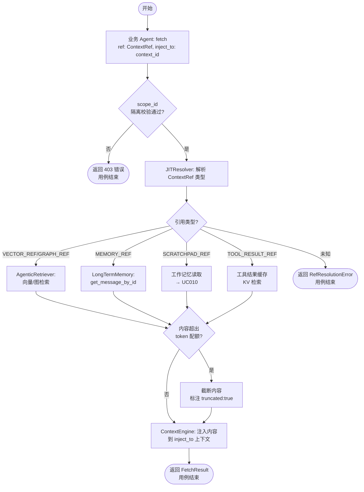

---

### UC005 — 混合式召回策略

| 字段 | 内容 |
|------|------|
| **用例名称** | UC005 — 混合式召回策略 |
| **用例描述** | ContextAgent 根据任务复杂度、时延预算和历史命中效果，在预取注入（pre-fetch）和运行时探索（JIT）之间动态切换，并通过统一入口协调 openJiuwen 内部和外部多类存储的混合检索。 |
| **Actor** | 主 Actor：业务 Agent   辅助 Actor：openJiuwen `HybridRetriever`、`LongTermMemory`、外部存储系统 |
| **前置条件** | 1. 策略配置（`HybridStrategyConfig`）已加载   2. 业务 Agent 携带 `task_context`（含复杂度估算）和 `latency_budget_ms` |
| **最小保证** | 无论策略切换如何，至少执行一次召回并返回结果；策略选择过程不影响调用方 |
| **成功保证** | 在 `latency_budget_ms` 内完成多路召回并合并返回；返回内容包含策略标注（`strategy: prefetch|jit|hybrid`） |
| **触发事件** | 业务 Agent 调用 `ContextAgent.recall(task_context, query, latency_budget_ms)` |

**主成功场景**

> P1. 业务 Agent 调用 recall 接口，携带 `task_context`（含复杂度估算分）、`query` 和 `latency_budget_ms`
> P2. `HybridStrategyScheduler` 评估策略：
> &nbsp;&nbsp;&nbsp;若 `task_complexity < LOW_THRESHOLD` 且 `latency_budget_ms < 100ms` → 选择 **prefetch**（仅注入稳定高频信息）
> &nbsp;&nbsp;&nbsp;若 `task_complexity > HIGH_THRESHOLD` → 选择 **jit**（携带引用，运行时按需探索）
> &nbsp;&nbsp;&nbsp;否则 → 选择 **hybrid**（预取基础上下文 + 注册 JIT 引用供后续按需拉取）
> P3. 执行选定策略的召回逻辑：
> &nbsp;&nbsp;&nbsp;**prefetch**：调用 `LongTermMemory.search_user_mem` + `get_recent_messages` 直接注入
> &nbsp;&nbsp;&nbsp;**jit**：仅返回 `ContextRef` 列表，不实际拉取内容（实际拉取由 UC004 完成）
> &nbsp;&nbsp;&nbsp;**hybrid**：预取基础上下文 + 生成 JIT 引用列表并注册
> P4. 对于 prefetch/hybrid 路径，调用 openJiuwen `HybridRetriever`（向量+稀疏+rerank）执行基础召回
> P5. 聚合结果，标注策略类型，更新 `HybridStrategyScheduler` 的历史命中记录（用于后续策略自适应）
> P6. 返回召回结果（含内容列表 + `ContextRef` 列表 + 策略标注）

**扩展场景**

> **2a.** `task_context` 缺少复杂度信息
> &nbsp;&nbsp;&nbsp;2a1. `HybridStrategyScheduler` 降级使用默认策略（hybrid），继续 P3

> **4a.** `HybridRetriever` 向量检索节点不可用
> &nbsp;&nbsp;&nbsp;4a1. 降级为仅稀疏检索（复用 `SparseRetriever`），记录降级日志
> &nbsp;&nbsp;&nbsp;4a2. 继续 P5

> **5a.** 历史命中率低于阈值（如 < 30%，连续 10 次）
> &nbsp;&nbsp;&nbsp;5a1. `HybridStrategyScheduler` 触发策略自适应调整（提升 JIT 比例）

**非功能属性**

| 类别 | 要求 |
|------|------|
| 性能 | prefetch 路径 P95 < 150ms；jit 路径（仅返回 ContextRef）P95 < 10ms；hybrid 路径 P95 < 250ms |
| 可靠性 | HybridRetriever 向量节点故障时自动降级稀疏检索；策略切换失败时执行默认策略 |
| 安全 | ContextRef 列表中不含原始内容，仅含定位信息 |
| 可测试性 | `HybridStrategyScheduler` 策略选择逻辑可通过注入 `task_complexity` 和 `latency_budget_ms` 独立测试三种路径 |

**架构影响**

新增 `HybridStrategyScheduler` 类，维护策略选择规则和历史命中统计；新增 `HybridStrategyConfig` 配置模型（`low_complexity_threshold`、`high_complexity_threshold`、默认策略）；复用 openJiuwen `HybridRetriever`（`openjiuwen.core.retrieval.retriever.hybrid_retriever`）执行向量+稀疏+rerank 检索；jit 路径生成的 `ContextRef` 列表通过 UC004 接口消费；策略历史命中记录存储于 `HotTierCache`（Redis/内存 KV）。

**UML 活动图**

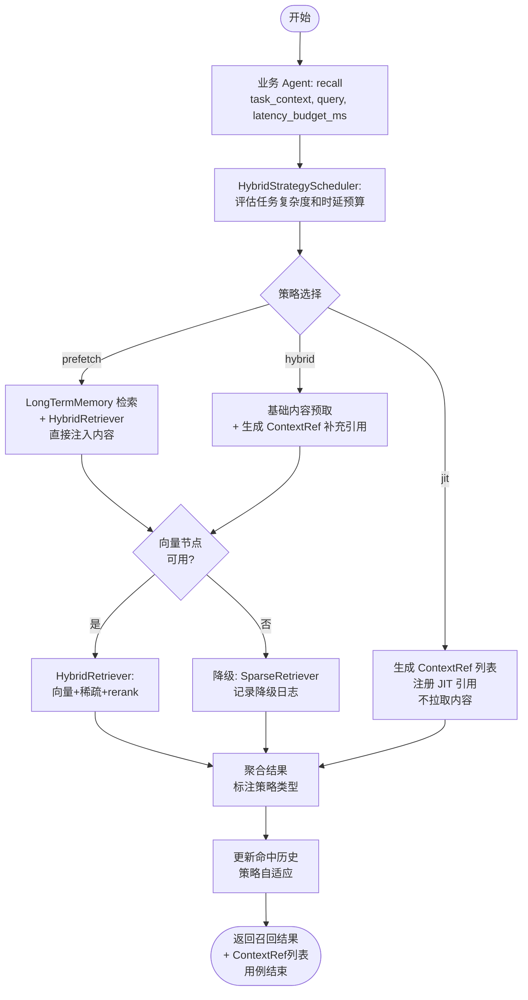

---

### UC006 — 上下文暴露控制

| 字段 | 内容 |
|------|------|
| **用例名称** | UC006 — 上下文暴露控制 |
| **用例描述** | 业务 Agent 在发起模型调用前，请求 ContextAgent 按当前任务的暴露控制规则构建上下文视图，精细控制哪些记忆类别、工具描述、scratchpad 字段和中间结果可注入本次模型调用。 |
| **Actor** | 主 Actor：业务 Agent   辅助 Actor：openJiuwen `AgentMemoryConfig`、`ContextEngine` |
| **前置条件** | 1. `ExposurePolicy`（暴露控制策略）已为当前任务/场景配置   2. 业务 Agent 持有 `context_id` 和 `task_id` |
| **最小保证** | 若暴露策略未找到，返回默认最小集合（仅暴露对话历史最近 5 轮，不暴露工具和记忆类别）；策略评估失败不导致全量上下文泄露 |
| **成功保证** | 返回严格符合 `ExposurePolicy` 规则的 `ContextView`，仅包含策略允许的字段和类别 |
| **触发事件** | 业务 Agent 调用 `ContextAgent.build_view(context_id, task_id, policy_id)` |

**主成功场景**

> P1. 业务 Agent 调用 `build_view` 接口，携带 `context_id`、`task_id` 和 `policy_id`
> P2. `ExposureController` 加载 `policy_id` 对应的 `ExposurePolicy`（含允许的记忆类别、scratchpad 可见字段、工具描述白名单、中间结果过滤规则）
> P3. `ExposureController` 从 `ContextEngine` 获取当前完整上下文
> P4. 按策略过滤各维度：
> &nbsp;&nbsp;&nbsp;P4a. 记忆类别过滤：仅保留 `ExposurePolicy.allowed_memory_types` 中的类型（复用 openJiuwen `AgentMemoryConfig` 类型开关逻辑）
> &nbsp;&nbsp;&nbsp;P4b. scratchpad 字段过滤：仅保留 `allowed_scratchpad_fields` 指定的字段
> &nbsp;&nbsp;&nbsp;P4c. 工具描述过滤：仅保留 `allowed_tool_ids` 列表中的工具（复用 `AbilityManager` 工具注册表）
> &nbsp;&nbsp;&nbsp;P4d. 中间结果过滤：将 `state_only` 标注的中间结果排除在 `ContextView` 之外
> P5. 构建 `ContextView` 对象并返回

**扩展场景**

> **2a.** `policy_id` 不存在
> &nbsp;&nbsp;&nbsp;2a1. `ExposureController` 使用默认最小策略（default policy），记录策略缺失告警

> **4a.** `allowed_tool_ids` 包含未注册的工具 ID
> &nbsp;&nbsp;&nbsp;4a1. 跳过未注册工具，在 `ContextView.metadata` 中记录 `unresolved_tools` 列表

> **4b.** 业务 Agent 请求的 task_id 与 context_id 归属的 scope 不匹配
> &nbsp;&nbsp;&nbsp;4b1. 拒绝请求，返回 403 错误，不构建任何 ContextView

**非功能属性**

| 类别 | 要求 |
|------|------|
| 性能 | P95 < 30ms（policy 评估和过滤均在内存中执行，不涉及外部 IO） |
| 可靠性 | 策略加载失败时降级为默认最小策略，不允许空策略；策略变更热加载不影响进行中的调用 |
| 安全 | `ExposurePolicy` 存储访问需鉴权；`state_only` 字段不可绕过；跨 scope 请求强制拒绝 |
| 可测试性 | 各过滤维度（记忆类别/scratchpad字段/工具/中间结果）可独立测试；`ContextView` 结构可序列化断言 |

**架构影响**

新增 `ExposureController` 类，封装策略加载和多维度过滤逻辑；新增 `ExposurePolicy` 数据模型（`allowed_memory_types: List[MemoryType]`、`allowed_scratchpad_fields: List[str]`、`allowed_tool_ids: List[str]`、`state_only_fields: List[str]`）；新增 `ContextView` 数据模型（过滤后的上下文视图，区别于全量 ContextSnapshot）；复用 openJiuwen `AgentMemoryConfig` 的类型开关逻辑作为记忆类别过滤的实现参考；复用 `AbilityManager` 工具注册表进行工具 ID 解析；`ExposurePolicy` 存储于 KV 存储（支持热更新）。

**UML 活动图**

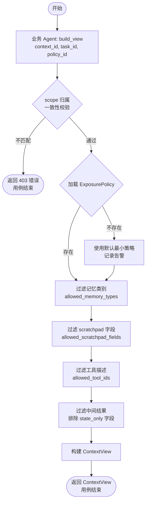

---

### UC007 — Agent 上下文接口调用

| 字段 | 内容 |
|------|------|
| **用例名称** | UC007 — Agent 上下文接口调用 |
| **用例描述** | 业务 Agent 通过 ContextAgent 的标准化 API 按需获取所需形态的上下文输出（快照、摘要、记忆检索结果、压缩后任务背景），屏蔽底层记忆、检索、压缩机制的差异。 |
| **Actor** | 主 Actor：业务 Agent   辅助 Actor：UC001（聚合）、UC009（压缩）、UC002（记忆检索）、openJiuwen `TaskMemoryService` |
| **前置条件** | 1. ContextAgent 服务可用   2. `scope_id`、`user_id` 和请求类型（`output_type`）已由业务 Agent 提供 |
| **最小保证** | 任何 `output_type` 请求失败时，返回明确错误码和失败原因，不返回空对象；API 调用不影响底层上下文存储状态 |
| **成功保证** | 返回与 `output_type` 匹配的标准化输出对象（`ContextOutput`），包含内容、来源元数据和 token 消耗统计 |
| **触发事件** | 业务 Agent 调用 `ContextAgent.get_context(scope_id, user_id, output_type, options)` |

**主成功场景**

> P1. 业务 Agent 调用统一上下文接口，携带 `output_type`（枚举：`SNAPSHOT`/`SUMMARY`/`SEARCH`/`COMPRESSED_BACKGROUND`）和对应 `options`
> P2. `ContextAPIRouter` 根据 `output_type` 路由到对应处理器：
> &nbsp;&nbsp;&nbsp;`SNAPSHOT` → 调用 UC001（多源聚合），返回完整 `ContextSnapshot`
> &nbsp;&nbsp;&nbsp;`SUMMARY` → 调用 openJiuwen `TaskMemoryService.summarize`，返回对话/任务摘要
> &nbsp;&nbsp;&nbsp;`SEARCH` → 调用 UC002（分层记忆检索），返回相关记忆列表
> &nbsp;&nbsp;&nbsp;`COMPRESSED_BACKGROUND` → 调用 UC009（压缩），返回压缩后的任务背景文本
> P3. 对应处理器执行并返回原始结果
> P4. `ContextAPIRouter` 将结果封装为统一 `ContextOutput` 格式（含 `type`、`content`、`metadata.sources`、`metadata.token_count`）
> P5. 返回 `ContextOutput` 给业务 Agent

**扩展场景**

> **2a.** `output_type` 为未知枚举值
> &nbsp;&nbsp;&nbsp;2a1. 返回 `UNSUPPORTED_OUTPUT_TYPE` 错误，列出支持的类型

> **3a.** 下游处理器（如 UC009 压缩）超时
> &nbsp;&nbsp;&nbsp;3a1. 返回 `PROCESSING_TIMEOUT` 错误，包含建议的替代 `output_type`（如降级为 `SUMMARY`）

> **1a.** 业务 Agent 在 `options` 中指定 `max_tokens`
> &nbsp;&nbsp;&nbsp;1a1. `ContextAPIRouter` 将 `max_tokens` 传递给下游处理器，确保输出不超过上限

**非功能属性**

| 类别 | 要求 |
|------|------|
| 性能 | `SEARCH` 路径 P95 < 200ms；`SUMMARY`/`COMPRESSED_BACKGROUND` 含 LLM 调用，P95 < 2s；`SNAPSHOT` P95 < 300ms |
| 可靠性 | 统一接口对下游处理器失败进行隔离，单处理器失败不导致整个接口不可用 |
| 安全 | 统一接口层统一处理 `scope_id`/`user_id` 鉴权，下游处理器信任统一接口的鉴权结果 |
| 可测试性 | `ContextAPIRouter` 路由逻辑可通过 `output_type` 枚举独立测试；下游处理器可 Mock；`ContextOutput` 结构标准化，便于断言 |

**架构影响**

新增 `ContextAPIRouter` 类，作为 ContextAgent 对外唯一 API 入口，封装 `output_type` 路由逻辑；新增 `ContextOutput` 统一输出数据模型；各 `output_type` 路由到对应内部 UC（UC001/UC002/UC009）或 openJiuwen 原生接口（`TaskMemoryService.summarize`）；该 Router 是 ContextAgent 对外 API 的核心门面（Facade 模式）。

**UML 活动图**

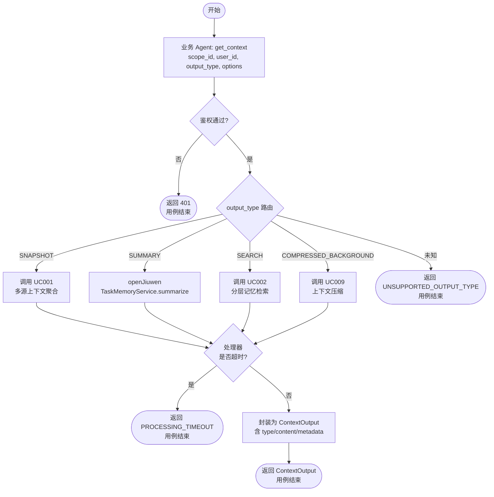

---

### UC008 — 记忆异步处理与更新

| 字段 | 内容 |
|------|------|
| **用例名称** | UC008 — 记忆异步处理与更新 |
| **用例描述** | 当新记忆被写入 openJiuwen `LongTermMemory` 后，ContextAgent 启动异步处理流水线，执行冗余检测、冲突解决和记忆更新，并在处理完成后将最新记忆状态同步回业务 Agent 可访问的上下文中。 |
| **Actor** | 主 Actor：系统（后台触发）   辅助 Actor：openJiuwen `LongTermMemory`、`MemUpdateChecker`、业务 Agent（接收通知） |
| **前置条件** | 1. openJiuwen `LongTermMemory.add_messages` 调用已完成   2. 异步处理队列已初始化 |
| **最小保证** | 异步处理失败时，原始写入的记忆保持不变（不因处理失败而丢失数据）；失败事件记录到告警日志 |
| **成功保证** | 处理完成后，冗余记忆已合并/删除，冲突记忆已解决或标注，最新记忆状态已通知到关联的业务 Agent 上下文 |
| **触发事件** | openJiuwen `LongTermMemory.add_messages` 写入完成后，发布 `MEMORY_WRITTEN` 内部事件 |

**主成功场景**

> P1. `LongTermMemory.add_messages` 写入完成，发布 `MEMORY_WRITTEN` 内部事件（含 `user_id`、`scope_id`、新写入的 message IDs）
> P2. `AsyncMemoryProcessor` 订阅 `MEMORY_WRITTEN` 事件，将处理任务加入异步队列（不阻塞主调用链路）
> P3. `AsyncMemoryProcessor` 从队列消费任务，执行处理流水线：
> &nbsp;&nbsp;&nbsp;P3a. 调用 `MemUpdateChecker`（复用 openJiuwen）检测新记忆与现有记忆的冗余/冲突关系
> &nbsp;&nbsp;&nbsp;P3b. 对 `REDUNDANT` 记忆：合并内容，删除冗余条目（`LongTermMemory.delete_mem_by_id`）
> &nbsp;&nbsp;&nbsp;P3c. 对 `CONFLICTING` 记忆：标注冲突（`conflict` 标签），不自动删除，等待 UC003 处理
> &nbsp;&nbsp;&nbsp;P3d. 更新记忆摘要（调用 `LongTermMemory.update_mem_by_id`）
> P4. 处理完成后，`AsyncMemoryProcessor` 发布 `MEMORY_UPDATED` 事件（含处理结果摘要：新增/合并/冲突标注数量）
> P5. ContextAgent 订阅 `MEMORY_UPDATED` 事件，刷新关联 `context_id` 的 ContextEngine 上下文缓存
> P6. 若业务 Agent 注册了回调，调用 `on_memory_updated(scope_id, update_summary)` 通知

**扩展场景**

> **3a.** `MemUpdateChecker` LLM 调用失败（超时或错误）
> &nbsp;&nbsp;&nbsp;3a1. 跳过 LLM 检测，基于规则执行轻量去重（精确匹配）
> &nbsp;&nbsp;&nbsp;3a2. 标记处理记录为 `degraded_processing`，不影响后续流程

> **3b.** 处理队列积压（待处理任务 > 配置阈值）
> &nbsp;&nbsp;&nbsp;3b1. 触发告警通知运维
> &nbsp;&nbsp;&nbsp;3b2. 低优先级任务（如历史冷层记忆处理）让位高优先级任务（如当前会话记忆处理）

> **5a.** 关联的 `context_id` 已过期或不存在
> &nbsp;&nbsp;&nbsp;5a1. 跳过缓存刷新，仅存储处理结果，等待下次上下文加载时生效

**非功能属性**

| 类别 | 要求 |
|------|------|
| 性能 | 异步处理不阻塞主链路（写入操作 P95 < 10ms 额外延迟）；处理队列延迟 P95 < 5s（从写入到处理完成） |
| 可靠性 | 处理失败不丢失原始数据；失败任务支持重试（最多 3 次，指数退避）；幂等处理（相同 message ID 重复处理不产生副作用） |
| 安全 | 异步处理过程中的记忆访问使用与主链路相同的 `scope_id`/`user_id` 隔离 |
| 可测试性 | `AsyncMemoryProcessor` 可同步模式运行（测试模式下跳过异步队列）；`MEMORY_UPDATED` 事件可观测，含处理结果结构化数据 |

**架构影响**

新增 `AsyncMemoryProcessor` 类，管理记忆处理异步队列（基于 asyncio.Queue 或 openJiuwen `extensions/message_queue`）；新增 `MEMORY_WRITTEN`/`MEMORY_UPDATED` 内部事件定义（扩展 openJiuwen Callback events 机制，复用 `openjiuwen.core.runner.callback.events`）；复用 openJiuwen `MemUpdateChecker`（`openjiuwen.core.memory.manage.update.mem_update_checker`）执行冲突/冗余检测；复用 `LongTermMemory.delete_mem_by_id`/`update_mem_by_id` 执行记忆更新操作；队列存储可选 in-memory（轻量部署）或 Pulsar（分布式部署，复用 `extensions/message_queue/message_queue_pulsar.py`）。

**UML 活动图**

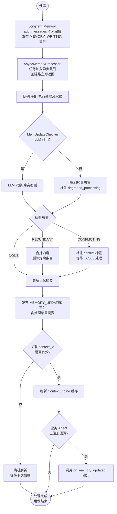

---

### UC009 — 上下文压缩与摘要

| 字段 | 内容 |
|------|------|
| **用例名称** | UC009 — 上下文压缩与摘要 |
| **用例描述** | ContextAgent 在 token 使用量超阈值、任务阶段切换或显式请求时，通过可插拔压缩策略对上下文历史进行压缩、裁剪和摘要，输出精炼后的上下文并释放 token 空间。支持按业务场景（问答/任务执行/长会话）配置策略。 |
| **Actor** | 主 Actor：业务 Agent（显式触发）或 ContextAgent（自动触发）   辅助 Actor：openJiuwen `DialogueCompressor`、`MessageSummaryOffloader`、`TaskMemoryService.summarize` |
| **前置条件** | 1. 压缩策略注册表已初始化，至少有一个默认策略   2. `context_id` 有效且上下文包含可压缩内容 |
| **最小保证** | 压缩失败时保留原始上下文不变（不部分压缩）；返回失败原因 |
| **成功保证** | 压缩后上下文 token 数量降低到目标阈值以下；关键信息（关键决策、架构约束、未决问题、当前执行状态）在 compaction 机制下高保真保留 |
| **触发事件** | 自动触发：token 使用量 > 80% 阈值；手动触发：业务 Agent 调用 `ContextAgent.compress(context_id, strategy_id, options)` |

**主成功场景**

> P1. 触发压缩（自动或手动），ContextAgent 接收 `context_id`、`strategy_id`（可选）和 `options`（含目标 token 阈值、场景类型）
> P2. `CompressionStrategyRouter` 根据 `strategy_id` 和 `scene_type` 选择压缩策略：
> &nbsp;&nbsp;&nbsp;`scene_type=QA` → `DialogueCompressor`（复用 openJiuwen，轮次级压缩）
> &nbsp;&nbsp;&nbsp;`scene_type=TASK_EXECUTION` → `TaskMemoryService.summarize`（ACE/ReasoningBank/ReME 算法）+ `MessageSummaryOffloader`（offload 大消息）
> &nbsp;&nbsp;&nbsp;`scene_type=LONG_SESSION` → 滚动摘要：`RoundLevelCompressor` + `MessageSummaryOffloader`
> &nbsp;&nbsp;&nbsp;`scene_type=HIGH_REALTIME` → `CurrentRoundCompressor`（低成本快速压缩，不调用 LLM）
> &nbsp;&nbsp;&nbsp;`scene_type=COMPACTION`（接近上下文上限）→ 高保真 Compaction：提取关键决策/约束/未决问题/执行状态，清理重复和低价值工具结果
> P3. 执行选定策略，对上下文进行压缩处理
> P4. 压缩完成后，更新 `ContextEngine` 中的上下文（`save_contexts`），释放已压缩消息的 token 空间
> P5. 返回 `CompressionResult`（含压缩前/后 token 数、压缩率、使用的策略 ID）

**扩展场景**

> **2a.** `strategy_id` 不存在，且 `scene_type` 未指定
> &nbsp;&nbsp;&nbsp;2a1. 使用默认策略（`DialogueCompressor`）

> **3a.** LLM 压缩调用失败
> &nbsp;&nbsp;&nbsp;3a1. 降级为规则压缩（删除重复消息和空工具结果）
> &nbsp;&nbsp;&nbsp;3a2. 在 `CompressionResult` 中标注 `degraded: true`

> **3b.** 压缩后仍超出目标 token 阈值
> &nbsp;&nbsp;&nbsp;3b1. `CompressionStrategyRouter` 自动升级为更激进策略（依次：QA → LONG_SESSION → COMPACTION）
> &nbsp;&nbsp;&nbsp;3b2. 重新执行 P3

> **1a.** 场景为 COMPACTION（接近 token 上限）
> &nbsp;&nbsp;&nbsp;1a1. 优先保留关键信息（关键决策、约束、未决问题、当前阶段进度），清理低价值工具调用结果（原始 JSON 响应超过 1000 tokens 的工具输出）
> &nbsp;&nbsp;&nbsp;1a2. 生成结构化 compaction 摘要并存入工作记忆（UC010）

**非功能属性**

| 类别 | 要求 |
|------|------|
| 性能 | `HIGH_REALTIME` 策略 P95 < 50ms；LLM 策略（QA/TASK/LONG_SESSION）异步执行，不阻塞主链路；COMPACTION P95 < 3s |
| 可靠性 | 压缩操作原子：成功则更新上下文，失败则原上下文完整保留；幂等（相同 context_id 重复压缩不产生错误） |
| 安全 | 压缩后的摘要不包含比原始内容更多的信息（不泄露被过滤的 state_only 字段） |
| 可测试性 | `CompressionStrategyRouter` 策略路由逻辑可独立测试；各压缩策略产出 `CompressionResult`，含 token 统计，便于验证压缩率；Compaction 产出可断言关键信息保留情况 |

**架构影响**

新增 `CompressionStrategyRouter` 类，实现插拔式策略路由（注册表模式，`strategy_id → CompressionStrategy` 映射）；新增 `CompressionStrategy` 抽象接口，各策略实现该接口；新增 `CompactionProcessor` 类，处理高保真 Compaction（识别关键决策/约束/未决问题的提取规则）；复用 openJiuwen `DialogueCompressor`/`RoundLevelCompressor`/`CurrentRoundCompressor`（`openjiuwen.core.context_engine.processor.compressor`）；复用 `MessageSummaryOffloader`（`openjiuwen.core.context_engine.processor.offloader`）；复用 `TaskMemoryService.summarize`（ACE/ReasoningBank/ReME 算法）；压缩结果通过 `ContextEngine.save_contexts` 持久化。

**UML 活动图**

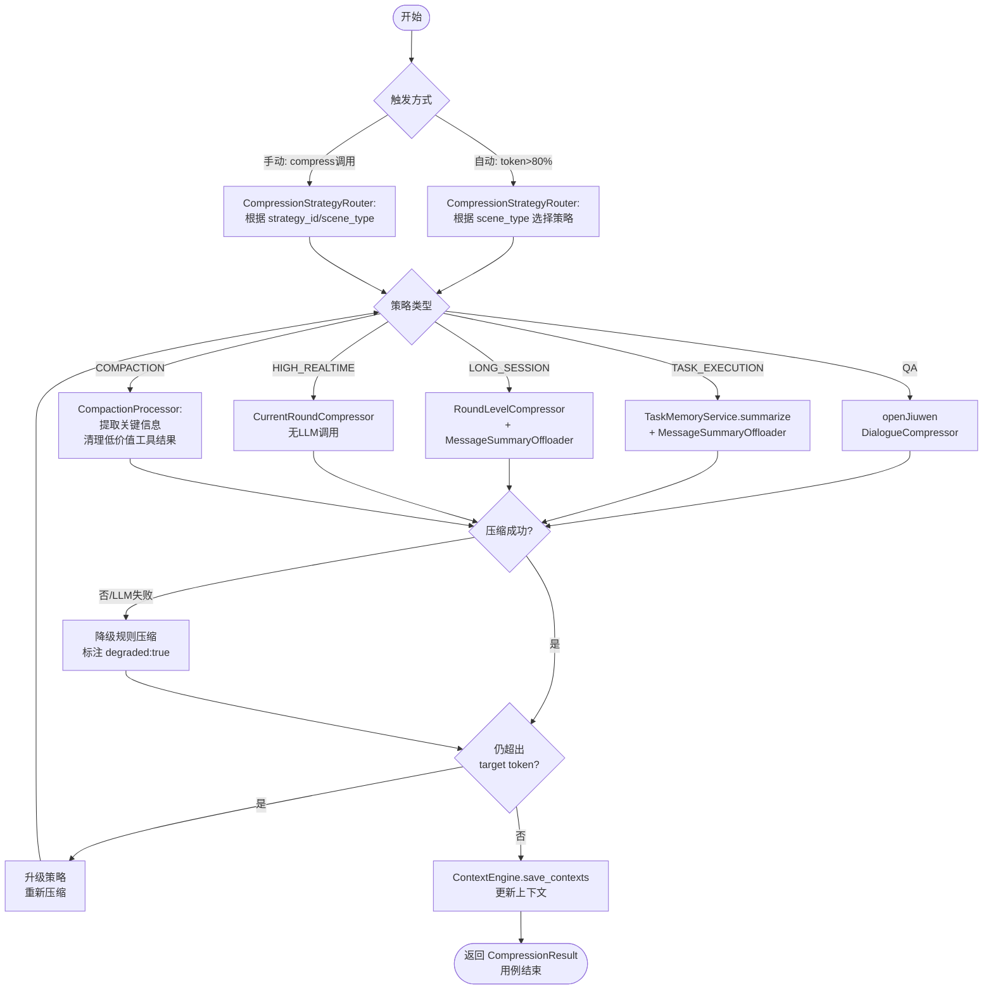

---

### UC010 — 结构化笔记与工作记忆管理

| 字段 | 内容 |
|------|------|
| **用例名称** | UC010 — 结构化笔记与工作记忆管理 |
| **用例描述** | 业务 Agent 将关键中间状态（任务计划、关键决策、未决事项、风险项）以结构化 schema 持久化到主上下文窗口之外（工作记忆），并在后续阶段按需将其重新注入上下文，实现低开销的跨阶段状态保持。 |
| **Actor** | 主 Actor：业务 Agent   辅助 Actor：openJiuwen `MemoryType.VARIABLE`（KV 型工作变量）、`JSONFileConnector`（文件型工作记忆） |
| **前置条件** | 1. 工作记忆存储已初始化（KV 或文件模式）   2. `scope_id`、`session_id` 和笔记 schema 已确定 |
| **最小保证** | 写入失败时返回明确错误，不产生部分写入的损坏笔记；读取时若笔记不存在返回空而非错误 |
| **成功保证** | 笔记成功持久化到上下文窗口外；按需重新注入后，内容完整无损 |
| **触发事件** | 业务 Agent 调用 `ContextAgent.write_note(scope_id, session_id, note_type, content)` 或 `ContextAgent.read_note(scope_id, session_id, note_type)` 或 `ContextAgent.inject_note(context_id, note_keys)` |

**主成功场景（写入笔记）**

> P1. 业务 Agent 调用 `write_note`，携带 `note_type`（枚举：`TASK_PLAN`/`KEY_DECISION`/`OPEN_QUESTION`/`RISK_ITEM`/`CURRENT_STATUS`）和 `content`
> P2. `WorkingMemoryManager` 按 `note_type` 对应的 schema 校验 `content` 结构
> P3. 将笔记序列化，存入工作记忆存储：
> &nbsp;&nbsp;&nbsp;部署轻量模式 → 使用 openJiuwen `JSONFileConnector`（文件型）
> &nbsp;&nbsp;&nbsp;部署运行时模式 → 使用 openJiuwen `LongTermMemory` 的 `VARIABLE` 类型（KV 型）
> P4. 返回写入确认（`NoteRef`，含 `note_id` 和 `note_type`）

**主成功场景（重新注入）**

> P5. 业务 Agent 调用 `inject_note(context_id, note_keys)`，携带需要注入的笔记键列表
> P6. `WorkingMemoryManager` 按 `note_keys` 从工作记忆存储读取对应笔记
> P7. 将笔记格式化为上下文友好的文本块（含结构标注）
> P8. 调用 `ContextEngine` 将格式化笔记注入 `context_id` 上下文
> P9. 返回注入确认（含注入的 token 数量）

**扩展场景**

> **2a.** `content` 不符合 `note_type` schema（如 `TASK_PLAN` 缺少 `steps` 字段）
> &nbsp;&nbsp;&nbsp;2a1. 返回 `SCHEMA_VALIDATION_ERROR`，列出缺失字段

> **6a.** `note_keys` 中某个键不存在
> &nbsp;&nbsp;&nbsp;6a1. 跳过该键，在注入确认中标注 `missing_keys` 列表

> **3a.** KV 存储写入失败（如 Redis 不可用）
> &nbsp;&nbsp;&nbsp;3a1. 降级到文件型存储（JSONFileConnector），记录降级日志

**非功能属性**

| 类别 | 要求 |
|------|------|
| 性能 | 写入 P95 < 20ms（KV 模式）；读取/注入 P95 < 30ms |
| 可靠性 | 写入操作原子；KV 存储失败时降级文件型存储；工作记忆与长期记忆隔离（工作记忆仅 session 级生命周期，session 结束后可清理） |
| 安全 | 工作记忆按 `scope_id` + `session_id` 隔离，不允许跨 session 读取 |
| 可测试性 | 各 `note_type` schema 校验可独立单测；两种存储后端（文件/KV）可通过配置切换测试；注入操作通过 ContextEngine 状态可观测 |

**架构影响**

新增 `WorkingMemoryManager` 类，封装笔记写入/读取/注入逻辑；新增五类结构化笔记 schema（`TaskPlanNote`、`KeyDecisionNote`、`OpenQuestionNote`、`RiskItemNote`、`CurrentStatusNote`）；新增 `NoteRef` 数据模型；复用 openJiuwen `MemoryType.VARIABLE` + `update_variables`/`get_variables` 接口（KV 型工作记忆）；复用 openJiuwen `JSONFileConnector`（文件型工作记忆）；注入操作复用 `ContextEngine`；工作记忆生命周期（session 级）与长期记忆（跨 session）明确区分，session 结束时触发工作记忆清理。

**UML 活动图**

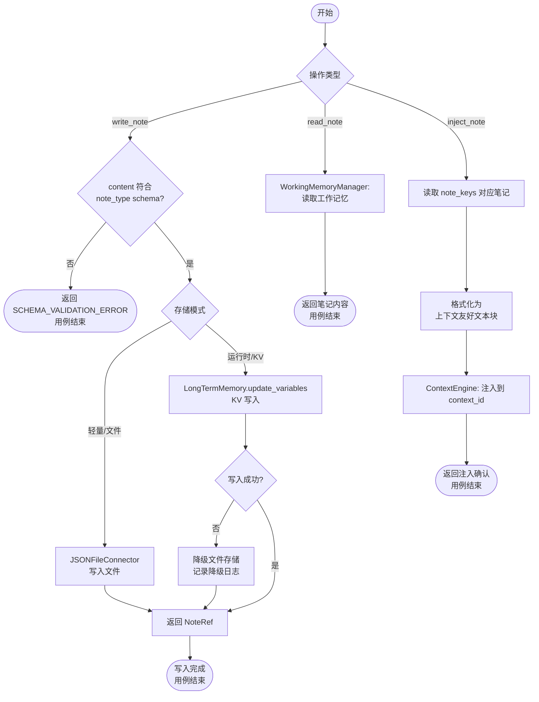

---

### UC011 — 工具上下文治理

| 字段 | 内容 |
|------|------|
| **用例名称** | UC011 — 工具上下文治理 |
| **用例描述** | 业务 Agent 在发起模型调用前，请求 ContextAgent 根据当前任务描述，从注册的全量工具集中检索并裁剪出相关工具子集，降低工具选择歧义，减少因工具描述过多导致的上下文污染。 |
| **Actor** | 主 Actor：业务 Agent   辅助 Actor：openJiuwen `AbilityManager`/`SkillManager`（工具注册表）、openJiuwen `HybridRetriever`（检索工具描述） |
| **前置条件** | 1. 全量工具集已在 `AbilityManager`/`SkillManager` 中注册，且每个工具有标准化描述   2. 工具描述向量索引已构建（首次或增量更新后） |
| **最小保证** | 即使检索失败，返回配置的默认工具集（非空），不返回空工具列表导致 Agent 无法执行 |
| **成功保证** | 返回与当前任务强相关的工具子集，工具数量不超过配置上限（如 20 个）；包含去重和歧义消解结果 |
| **触发事件** | 业务 Agent 调用 `ContextAgent.select_tools(task_description, context_id, max_tools)` |

**主成功场景**

> P1. 业务 Agent 调用 `select_tools`，携带 `task_description`（当前任务自然语言描述）、`context_id` 和 `max_tools`（返回工具数量上限）
> P2. `ToolContextGovernor` 调用 openJiuwen `AbilityManager` 获取全量工具注册表
> P3. 若工具总数 ≤ `TOOL_INLINE_THRESHOLD`（如 ≤ 15 个），直接返回全量工具集，跳过检索
> P4. 若工具总数 > `TOOL_INLINE_THRESHOLD`，执行检索式工具选择：
> &nbsp;&nbsp;&nbsp;P4a. 以 `task_description` 为查询，调用 `HybridRetriever`（tool description 向量索引）检索 top-K 相关工具
> &nbsp;&nbsp;&nbsp;P4b. 对检索结果进行去歧义：合并功能重叠的工具，为相似工具添加区分性描述标注
> P5. 对裁剪后的工具集进行标准化（统一描述格式、参数 schema 规范）
> P6. 返回工具子集列表（`ToolSelection`，含工具 ID、描述、参数 schema、相关性评分）

**扩展场景**

> **4a.** 工具描述向量索引未构建或已过期
> &nbsp;&nbsp;&nbsp;4a1. `ToolContextGovernor` 触发异步索引构建任务
> &nbsp;&nbsp;&nbsp;4a2. 本次请求降级为关键词匹配（工具名称 + 标签），返回 P5

> **4b.** 检索返回工具数 < `min_tools` 阈值
> &nbsp;&nbsp;&nbsp;4b1. 补充默认工具集（系统级通用工具）直到满足 `min_tools`

> **2a.** `AbilityManager` 返回空（无已注册工具）
> &nbsp;&nbsp;&nbsp;2a1. 返回 `NO_TOOLS_REGISTERED` 错误

**非功能属性**

| 类别 | 要求 |
|------|------|
| 性能 | 工具数 ≤ 阈值时 P95 < 10ms（直接返回）；检索模式 P95 < 100ms；索引构建为异步后台任务 |
| 可靠性 | 向量索引不可用时降级关键词匹配；默认工具集始终可用 |
| 安全 | 工具描述不暴露内部系统路径或认证信息；工具集裁剪基于任务上下文，不基于用户角色（角色鉴权在调用层处理） |
| 可测试性 | `ToolContextGovernor` 阈值可配置，便于测试检索路径和直接返回路径；去歧义逻辑可独立单测 |

**架构影响**

新增 `ToolContextGovernor` 类，封装工具选择逻辑；新增 `ToolSelection` 数据模型；需为工具描述构建向量索引（新增 `ToolDescriptionIndex`，基于 openJiuwen `SimpleKnowledgeBase`/`KnowledgeBase`）；复用 openJiuwen `AbilityManager`/`SkillManager` 获取工具注册表；复用 openJiuwen `HybridRetriever` 执行工具描述检索；工具描述标准化规范需在工具注册时强制执行（新增注册校验规则）。

**UML 活动图**

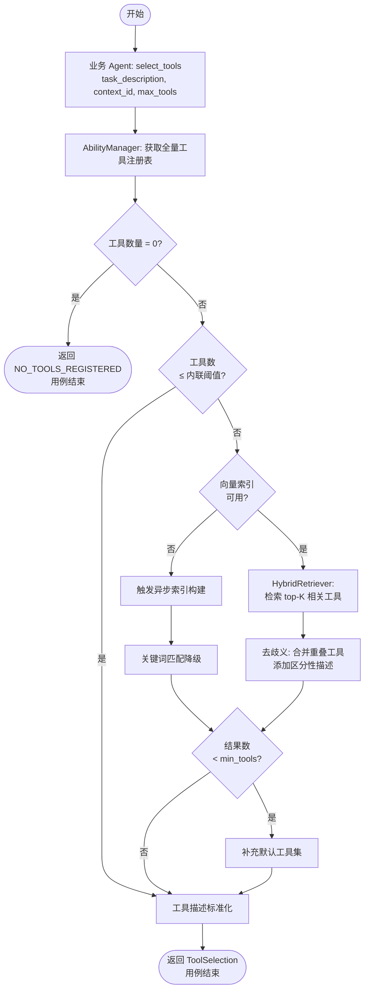

---

### UC012 — 结构化存储与混合检索

| 字段 | 内容 |
|------|------|
| **用例名称** | UC012 — 结构化存储与混合检索 |
| **用例描述** | 业务 Agent 提交复合检索请求，ContextAgent 通过统一检索入口，协调 embedding 检索、关键词检索、层级信号、图关系查询和 rerank 重排序的组合召回，返回高质量的多源检索结果。 |
| **Actor** | 主 Actor：业务 Agent   辅助 Actor：openJiuwen `HybridRetriever`（向量+稀疏）、`GraphRetriever`（图关系）、`StandardReranker`/`ChatReranker`（重排）、`LongTermMemory`（记忆检索） |
| **前置条件** | 1. 各检索后端（向量库、图数据库、LTM）已完成数据索引   2. `retrieval_plan`（检索计划）已由业务 Agent 提供或由系统自动推断 |
| **最小保证** | 至少有一个检索后端可用时返回结果；全部后端不可用时返回明确错误 |
| **成功保证** | 返回经过多路召回和 rerank 重排序的最终结果列表，每条结果标注来源类型和 score |
| **触发事件** | 业务 Agent 调用 `ContextAgent.hybrid_search(query, retrieval_plan, top_k)` |

**主成功场景**

> P1. 业务 Agent 调用 `hybrid_search`，携带 `query`、`retrieval_plan`（含启用的检索方式列表和各路权重）和 `top_k`
> P2. `UnifiedSearchCoordinator` 解析 `retrieval_plan`，并行启动各路检索：
> &nbsp;&nbsp;&nbsp;`VECTOR` → 调用 openJiuwen `HybridRetriever`（向量部分，Chroma/Milvus/PG）
> &nbsp;&nbsp;&nbsp;`SPARSE` → 调用 openJiuwen `HybridRetriever`（稀疏部分，关键词/BM25）
> &nbsp;&nbsp;&nbsp;`GRAPH` → 调用 openJiuwen `GraphRetriever`（图关系遍历）
> &nbsp;&nbsp;&nbsp;`MEMORY` → 调用 openJiuwen `LongTermMemory.search_user_mem`（记忆语义检索）
> &nbsp;&nbsp;&nbsp;`HIERARCHY` → 基于层级路径信号（文件系统结构/领域分类树）过滤候选
> P3. 等待各路检索完成（超时独立处理，超时路降级）
> P4. `UnifiedSearchCoordinator` 使用 fusion 算法（Reciprocal Rank Fusion）合并多路结果，去重
> P5. 调用 openJiuwen `StandardReranker` 或 `ChatReranker` 对合并候选进行 rerank 重排序
> P6. 取 rerank 后 top_k 结果，标注来源类型和 score，返回

**扩展场景**

> **2a.** 某路检索后端不可用（如图数据库连接失败）
> &nbsp;&nbsp;&nbsp;2a1. 标注该路为 `unavailable`，继续其他路检索
> &nbsp;&nbsp;&nbsp;2a2. 在结果 metadata 中记录 `degraded_sources`

> **5a.** Reranker 不可用
> &nbsp;&nbsp;&nbsp;5a1. 降级为仅基于 fusion score 排序，跳过 rerank
> &nbsp;&nbsp;&nbsp;5a2. 在结果 metadata 中标注 `rerank_skipped: true`

> **1a.** `retrieval_plan` 为空（业务 Agent 未指定）
> &nbsp;&nbsp;&nbsp;1a1. 使用默认检索计划（VECTOR + SPARSE + MEMORY，不启用 GRAPH 和 HIERARCHY）

**非功能属性**

| 类别 | 要求 |
|------|------|
| 性能 | 多路并行检索 + rerank，端到端 P95 < 300ms（含 rerank）；各路超时阈值独立配置（默认 200ms）|
| 可靠性 | 单路失败不影响整体返回；Reranker 降级不影响结果可用性；所有路均超时时返回错误 |
| 安全 | 跨 `scope_id` 的检索请求被拒绝；图数据库查询防止路径遍历攻击（深度限制） |
| 可测试性 | `retrieval_plan` 可精确控制启用的检索路，便于独立测试各路逻辑；fusion 算法可注入 mock 结果验证合并行为 |

**架构影响**

新增 `UnifiedSearchCoordinator` 类，封装多路并行检索和结果融合逻辑；新增 `RetrievalPlan` 数据模型（各路权重、超时配置）；复用 openJiuwen `HybridRetriever`（向量+稀疏+RRF fusion，`openjiuwen.core.retrieval.retriever.hybrid_retriever`）；复用 `GraphRetriever`（`openjiuwen.core.retrieval.retriever.graph_retriever`）；复用 `LongTermMemory.search_user_mem` 作为记忆检索路；复用 `StandardReranker`/`ChatReranker`（`openjiuwen.core.retrieval.reranker`）；新增层级信号检索器（`HierarchyRetriever`，基于路径前缀过滤）。

**UML 活动图**

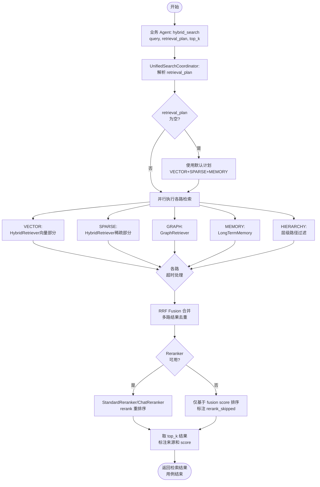

---

### UC013 — 上下文版本管理与回滚

| 字段 | 内容 |
|------|------|
| **用例名称** | UC013 — 上下文版本管理与回滚 |
| **用例描述** | ContextAgent 在关键节点自动或按需为上下文创建版本快照（snapshot），支持按版本 ID 回放或回滚上下文到历史状态，用于调试、审计和错误恢复。 |
| **Actor** | 主 Actor：业务 Agent（触发快照/回滚）、运维人员（查询历史版本）   辅助 Actor：openJiuwen `agent_evolving.checkpointing`（参考实现） |
| **前置条件** | 1. 上下文版本存储已初始化   2. 快照策略（触发时机）已配置 |
| **最小保证** | 快照创建失败时不影响主上下文状态；回滚操作在确认前不修改当前上下文 |
| **成功保证** | 快照成功创建并存储；回滚后当前上下文状态与目标版本一致 |
| **触发事件** | 快照触发：任务阶段切换事件、显式调用 `ContextAgent.create_snapshot(context_id, label)`；回滚触发：`ContextAgent.rollback(context_id, version_id)` |

**主成功场景（创建快照）**

> P1. 触发条件满足（阶段切换或显式调用），ContextAgent 接收 `context_id` 和 `label`（可选描述）
> P2. `ContextVersionManager` 从 `ContextEngine` 获取当前完整上下文状态（`save_contexts` 输出）
> P3. 创建 `ContextSnapshot` 版本记录（含 `version_id`、`timestamp`、`label`、上下文状态序列化数据、token 统计）
> P4. 将版本记录存入版本存储（KV 或对象存储，按 `context_id` 分组管理）
> P5. 返回 `version_id`

**主成功场景（回滚）**

> P6. 业务 Agent 调用 `rollback(context_id, version_id)`
> P7. `ContextVersionManager` 从版本存储加载目标版本的上下文状态
> P8. 生成 diff（当前状态 vs 目标版本），展示变更概要
> P9. 业务 Agent 确认回滚（或系统自动确认）
> P10. `ContextVersionManager` 将目标版本状态写回 `ContextEngine`（覆盖当前状态）
> P11. 返回回滚确认（含 diff 摘要）

**扩展场景**

> **2a.** 当前上下文状态序列化失败
> &nbsp;&nbsp;&nbsp;2a1. 返回 `SNAPSHOT_FAILED` 错误，不创建损坏的版本记录

> **7a.** `version_id` 不存在
> &nbsp;&nbsp;&nbsp;7a1. 返回 `VERSION_NOT_FOUND` 错误，列出可用版本列表

> **P4a.** 版本数量超过保留上限（如 > 50 个版本）
> &nbsp;&nbsp;&nbsp;P4a1. 自动清理最旧的版本（FIFO 策略），保留最近 N 个版本

**非功能属性**

| 类别 | 要求 |
|------|------|
| 性能 | 快照创建 P95 < 200ms（含序列化和存储写入）；回滚 P95 < 500ms |
| 可靠性 | 版本记录写入原子（使用事务或 CAS 操作）；回滚前必须确认步骤，防止误操作 |
| 安全 | 版本记录按 `scope_id` 隔离访问；版本内容加密存储（含敏感记忆数据） |
| 可测试性 | 版本创建和回滚操作可通过版本 ID 验证状态一致性；diff 输出结构化，便于断言 |

**架构影响**

新增 `ContextVersionManager` 类，管理版本创建、查询、回滚和清理；新增 `ContextVersionRecord` 数据模型（`version_id`、`context_id`、`timestamp`、`label`、`state: bytes`、`token_count`）；版本存储：轻量部署使用 KV（`BaseKVStore`），生产部署使用对象存储（复用 openJiuwen `extensions/store/object`）；参考 openJiuwen `agent_evolving.checkpointing.manager` 的设计，但聚焦上下文状态而非 Agent 完整状态；`ContextEngine.save_contexts` 输出作为快照数据来源。

**UML 活动图**

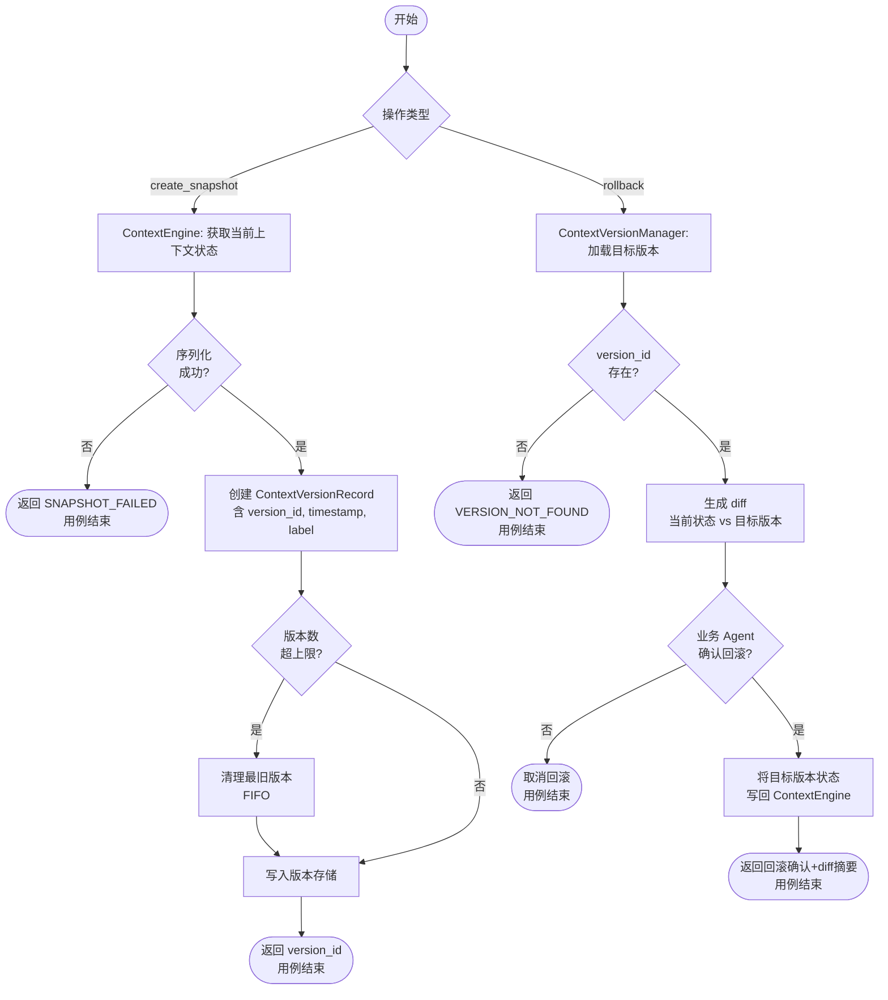

---

### UC014 — 子代理上下文隔离与摘要回传

| 字段 | 内容 |
|------|------|
| **用例名称** | UC014 — 子代理上下文隔离与摘要回传 |
| **用例描述** | 主 Agent 将复杂子任务分配给子 Agent 时，ContextAgent 为子 Agent 生成独立上下文空间，子 Agent 在隔离的上下文窗口中执行，完成后 ContextAgent 将子 Agent 上下文压缩为摘要并回传给主 Agent，避免探索细节污染主上下文。 |
| **Actor** | 主 Actor：主 Agent（发起子任务分配）、子 Agent（执行子任务）   辅助 Actor：openJiuwen `BaseGroup`/`multi_agent`（Agent 组管理）、`TaskMemoryService.summarize` |
| **前置条件** | 1. 主 Agent 和子 Agent 均已在 openJiuwen `BaseGroup` 中注册   2. 子任务描述和预期输出格式已确定 |
| **最小保证** | 子 Agent 上下文失败或超时时，向主 Agent 返回子任务失败通知，不向主 Agent 泄露子 Agent 的中间状态 |
| **成功保证** | 子 Agent 完成执行，压缩摘要成功回传主 Agent；主 Agent 上下文中不包含子 Agent 的执行细节，仅包含摘要结论 |
| **触发事件** | 主 Agent 调用 `ContextAgent.delegate_task(parent_context_id, task_description, sub_agent_id, output_schema)` |

**主成功场景**

> P1. 主 Agent 调用 `delegate_task`，携带 `parent_context_id`、`task_description`、`sub_agent_id` 和期望的 `output_schema`
> P2. `SubAgentContextManager` 生成交接摘要（`HandoffSummary`）：从 `parent_context_id` 提取子任务相关背景（复用 UC009 压缩），形成精简的子任务交接包
> P3. `SubAgentContextManager` 创建新的隔离上下文空间（独立 `child_context_id`），注入 `HandoffSummary` 作为初始上下文
> P4. 子 Agent 在 `child_context_id` 的隔离上下文中执行子任务（通过 openJiuwen `BaseGroup` 路由）
> P5. 子 Agent 执行完成后，`SubAgentContextManager` 调用 `TaskMemoryService.summarize` 对 `child_context_id` 上下文进行摘要压缩，按 `output_schema` 结构化输出
> P6. 将压缩摘要（`SubTaskSummary`）注入 `parent_context_id` 上下文（而非子 Agent 完整上下文）
> P7. 清理 `child_context_id` 的临时上下文空间
> P8. 返回 `SubTaskSummary` 给主 Agent

**扩展场景**

> **4a.** 子 Agent 执行超时（超过 `task_timeout` 配置）
> &nbsp;&nbsp;&nbsp;4a1. 中止子 Agent 执行，清理 `child_context_id`
> &nbsp;&nbsp;&nbsp;4a2. 向主 Agent 返回 `SubTaskTimeout` 通知（含已完成的步骤摘要，若有）

> **5a.** 子 Agent 上下文摘要无法满足 `output_schema` 结构
> &nbsp;&nbsp;&nbsp;5a1. 返回非结构化摘要，在 `SubTaskSummary` 中标注 `schema_compliant: false`

> **P3a.** 同一主 Agent 并发启动多个子 Agent
> &nbsp;&nbsp;&nbsp;P3a1. 每个子 Agent 获得独立 `child_context_id`，并行执行互不干扰
> &nbsp;&nbsp;&nbsp;P3a2. 所有子 Agent 完成后统一回传摘要，或逐个完成逐个回传（按 `aggregation_mode` 配置）

**非功能属性**

| 类别 | 要求 |
|------|------|
| 性能 | 交接摘要生成 P95 < 500ms；子 Agent 执行时间由任务本身决定；摘要回传 P95 < 1s |
| 可靠性 | 子 Agent 失败不影响主 Agent 上下文完整性；`child_context_id` 生命周期与子任务绑定，子任务结束后自动清理 |
| 安全 | `child_context_id` 与 `parent_context_id` 严格隔离，子 Agent 只能访问 `child_context_id`；`HandoffSummary` 中不包含 `ExposurePolicy` 标注为 `state_only` 的字段 |
| 可测试性 | 隔离性可通过断言子 Agent 无法访问 `parent_context_id` 验证；摘要回传内容按 `output_schema` 可断言 |

**架构影响**

新增 `SubAgentContextManager` 类，管理子任务交接摘要生成、隔离上下文创建、摘要回传和清理；新增 `HandoffSummary` 和 `SubTaskSummary` 数据模型；复用 openJiuwen `BaseGroup`/`multi_agent` 进行子 Agent 路由和执行；复用 `TaskMemoryService.summarize` 进行子 Agent 上下文压缩；子任务隔离上下文复用 `ContextEngine`（独立 `context_id`）；交接摘要生成复用 UC009（压缩）逻辑。

**UML 活动图**

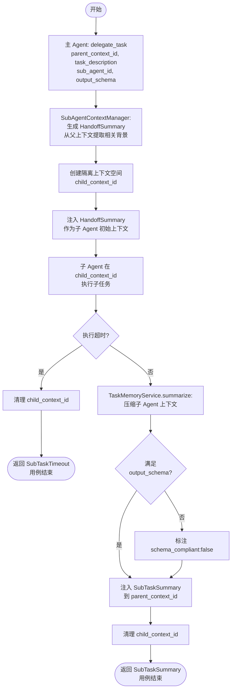

---

### UC015 — 多语言与多模态上下文扩展

| 字段 | 内容 |
|------|------|
| **用例名称** | UC015 — 多语言与多模态上下文扩展 |
| **用例描述** | 业务 Agent 提交含多语言文本或多模态内容（图像、音频等）的上下文请求，ContextAgent 识别内容类型和语言，路由到对应处理器进行格式统一和特征提取，封装为标准 `ContextItem` 后注入或存储。 |
| **Actor** | 主 Actor：业务 Agent   辅助 Actor：openJiuwen `EmbeddingConfig`（多模态 embedding 模型）、openJiuwen `base_embedding` |
| **前置条件** | 1. 多模态 embedding 模型已配置（如支持图文的 embedding API）   2. 多语言文本处理依赖（分词、语言检测）已初始化 |
| **最小保证** | 不支持的模态类型返回 `UNSUPPORTED_MODALITY` 错误，不静默忽略或产生空结果 |
| **成功保证** | 多语言/多模态内容成功提取特征并封装为标准 `ContextItem`，可与文本上下文统一存储和检索 |
| **触发事件** | 业务 Agent 调用 `ContextAgent.ingest_multimodal(content: MultimodalContent, scope_id, target_context_id)` |

**主成功场景**

> P1. 业务 Agent 提交 `MultimodalContent`（含 `modality: TEXT|IMAGE|AUDIO|VIDEO`、`language: str` 和原始内容）
> P2. `MultimodalProcessor` 检测内容类型和语言
> P3. 按 `modality` 路由处理：
> &nbsp;&nbsp;&nbsp;`TEXT`（非中文）→ 多语言文本标准化（语言标注 + 统一编码）
> &nbsp;&nbsp;&nbsp;`IMAGE` → 调用多模态 embedding 模型（复用 openJiuwen `EmbeddingConfig` + `base_embedding`）提取图像特征向量
> &nbsp;&nbsp;&nbsp;`AUDIO` → 语音转文本（`ASR`，外部服务），再按 TEXT 流程处理
> &nbsp;&nbsp;&nbsp;`VIDEO` → 提取关键帧（外部服务），再按 IMAGE 流程处理
> P4. 封装为标准 `ContextItem`（含 `modality`、`language`、`embedding_vector`（如适用）、`text_representation`（多模态摘要文本）、`raw_content_ref`（原始内容引用，不直接存储大文件））
> P5. 将 `ContextItem` 存入 `LongTermMemory` 或注入 `target_context_id`
> P6. 返回 `IngestResult`（含 `item_id` 和特征提取摘要）

**扩展场景**

> **2a.** 检测到不支持的 modality（如 `3D_MODEL`）
> &nbsp;&nbsp;&nbsp;2a1. 返回 `UNSUPPORTED_MODALITY` 错误，列出支持的模态类型

> **3a.** 多模态 embedding 模型 API 不可用
> &nbsp;&nbsp;&nbsp;3a1. 降级为仅存储文本摘要（人工提供或 LLM 生成），标注 `embedding_available: false`

> **3b.** 语言检测置信度低（< 0.7）
> &nbsp;&nbsp;&nbsp;3b1. 在 `ContextItem.metadata` 中标注 `language_confidence: low`，使用检测到的语言但不强制确认

**非功能属性**

| 类别 | 要求 |
|------|------|
| 性能 | 文本处理 P95 < 50ms；图像 embedding P95 < 500ms（依赖外部模型 API）；不阻塞主链路，支持异步处理 |
| 可靠性 | embedding 模型不可用时降级存储文本摘要；大文件（> 10MB）通过引用而非直接存储，避免内存溢出 |
| 安全 | 原始多模态内容（尤其图像）仅存储引用（`raw_content_ref`），不直接嵌入上下文；遵守内容安全策略 |
| 可测试性 | 各模态处理路径可独立测试；`MultimodalContent` 可注入 mock 内容；`EmbeddingConfig` 可替换 mock embedding 模型 |

**架构影响**

新增 `MultimodalProcessor` 类，封装多模态内容识别和路由；新增 `MultimodalContent` 和扩展的 `ContextItem`（新增 `modality`、`language`、`embedding_vector`、`text_representation`、`raw_content_ref` 字段）；复用 openJiuwen `EmbeddingConfig` + `base_embedding`/`api_embedding` 执行多模态 embedding；ASR 和视频关键帧提取作为外部服务（通过适配器接入，不内置实现）；大文件引用存储复用 openJiuwen `extensions/store/object`（S3 兼容）。

**UML 活动图**

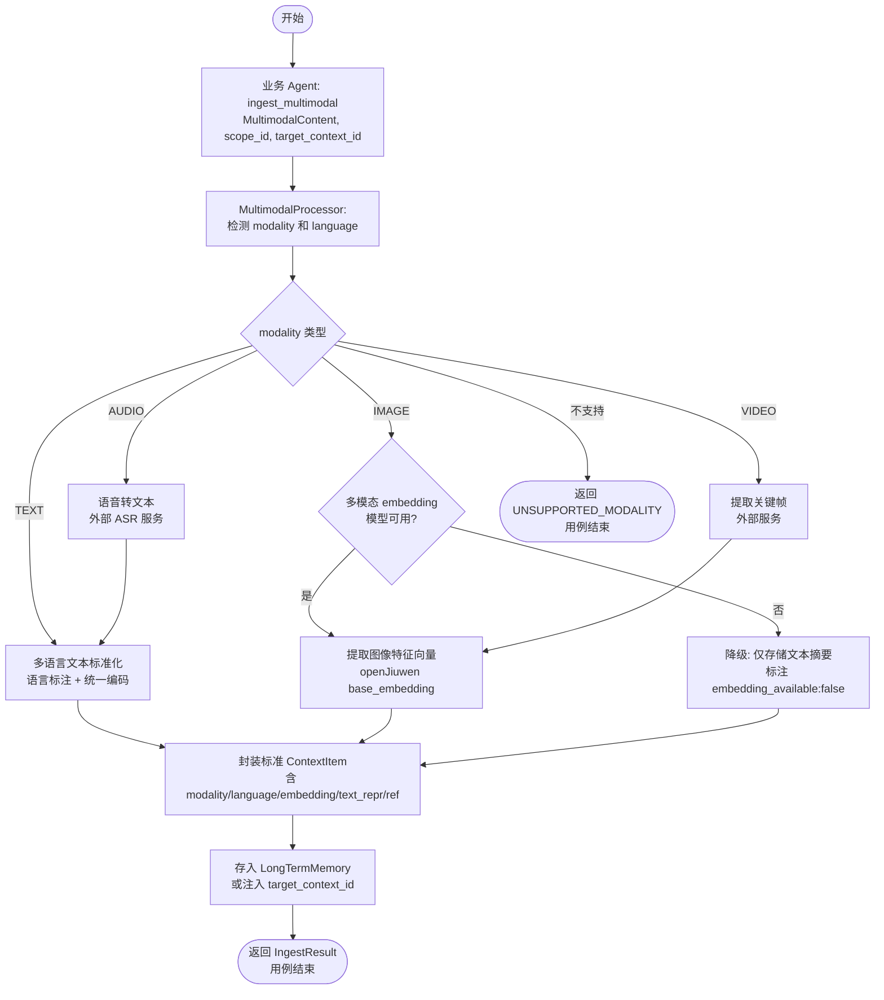

---

### UC016 — 召回质量与时延监控

| 字段 | 内容 |
|------|------|
| **用例名称** | UC016 — 召回质量与时延监控 |
| **用例描述** | ContextAgent 对每次上下文召回操作进行精度评分采集和端到端时延记录，将指标持久化到监控存储，支持 P50/P95/P99 统计分析，并在指标超出配置阈值时触发告警。 |
| **Actor** | 主 Actor：系统（自动采集）   辅助 Actor：运维人员/平台工程师（配置告警、查询指标）；openJiuwen Callback Events（`RetrievalEvents`、`ContextEvents`） |
| **前置条件** | 1. 监控指标存储已初始化（时序数据库或指标聚合服务）   2. 告警阈值已在配置中设定（`AlertConfig`） |
| **最小保证** | 指标采集失败不影响主链路业务；采集失败记录到错误日志，不静默丢弃 |
| **成功保证** | 每次召回操作的时延和质量评分被成功记录；超阈值时告警在 60s 内发出 |
| **触发事件** | openJiuwen `RetrievalEvents.RETRIEVAL_FINISHED` 或 `ContextEvents.CONTEXT_UPDATED` 回调事件 |

**主成功场景**

> P1. ContextAgent 完成一次上下文召回操作（UC002/UC004/UC005/UC012），触发 `RETRIEVAL_FINISHED` 回调事件（复用 openJiuwen `RetrievalEvents`）
> P2. `MonitoringCollector` 订阅该事件，异步采集指标（不阻塞主链路）：
> &nbsp;&nbsp;&nbsp;P2a. 端到端时延：从请求开始到结果返回的耗时（ms）
> &nbsp;&nbsp;&nbsp;P2b. 各层时延分解：热层/温层/冷层/rerank 各阶段耗时
> &nbsp;&nbsp;&nbsp;P2c. 召回质量评分：基于以下指标计算综合评分
> &nbsp;&nbsp;&nbsp;&nbsp;&nbsp;- 结果数量 vs 请求 top_k（召回率代理指标）
> &nbsp;&nbsp;&nbsp;&nbsp;&nbsp;- 各路降级标记数（degraded_sources 计数）
> &nbsp;&nbsp;&nbsp;&nbsp;&nbsp;- Reranker 是否执行（`rerank_skipped`）
> &nbsp;&nbsp;&nbsp;&nbsp;&nbsp;- 业务 Agent 反馈信号（若提供）
> P3. `MonitoringCollector` 将采集到的指标写入监控存储（时间序列格式：`{metric_name, value, timestamp, labels: {scope_id, uc_id, strategy}}`）
> P4. `AlertEngine` 异步检查当前指标窗口（滑动窗口，如 5 分钟）是否超出告警阈值：
> &nbsp;&nbsp;&nbsp;P95 时延 > 300ms（SLA 目标）→ 触发 `LATENCY_SLA_BREACH` 告警
> &nbsp;&nbsp;&nbsp;召回质量评分 < 阈值（如 < 0.6）→ 触发 `QUALITY_DEGRADATION` 告警
> &nbsp;&nbsp;&nbsp;降级率 > 阈值（如 > 20%）→ 触发 `HIGH_DEGRADATION_RATE` 告警
> P5. 超阈值时，`AlertEngine` 发出告警通知（Webhook / 消息队列 / 日志）

**扩展场景**

> **3a.** 监控存储写入失败
> &nbsp;&nbsp;&nbsp;3a1. 记录到本地错误日志，不重试（避免指标积压影响主链路）
> &nbsp;&nbsp;&nbsp;3a2. 返回指标采集降级告警（`METRICS_COLLECTION_FAILED`）

> **4a.** `AlertEngine` 处理积压（告警队列满）
> &nbsp;&nbsp;&nbsp;4a1. 丢弃低优先级告警（如 `QUALITY_DEGRADATION`），保留高优先级告警（如 `LATENCY_SLA_BREACH`）

> **P2c 延伸.** 运维人员调用 `ContextAgent.get_metrics(scope_id, time_range, metric_names)` 查询历史指标
> &nbsp;&nbsp;&nbsp;返回指定范围内的时序数据，支持 P50/P95/P99 分位数统计

**非功能属性**

| 类别 | 要求 |
|------|------|
| 性能 | 指标采集全异步，对主链路额外延迟 < 1ms；监控存储写入吞吐量支持 1000 QPS 指标写入 |
| 可靠性 | 监控系统故障不影响主链路；指标数据保留 30 天（可配置）；告警通知至少一次送达（at-least-once） |
| 安全 | 指标数据按 `scope_id` 隔离查询；告警通知内容不包含原始上下文数据，仅包含指标数值和标签 |
| 可测试性 | `MonitoringCollector` 支持 test 模式（同步写入，便于单测断言）；告警触发条件可通过注入 mock 指标数据测试；`AlertConfig` 阈值可在测试中覆盖 |

**架构影响**

新增 `MonitoringCollector` 类，订阅 openJiuwen Callback Events（`RetrievalEvents`、`ContextEvents`），封装指标采集和质量评分计算；新增 `AlertEngine` 类，维护滑动窗口告警检测逻辑；新增 `AlertConfig` 配置模型（各告警类型的阈值、通知渠道）；新增 `MetricsStore` 接口（实现：内存聚合（测试）、Prometheus push / InfluxDB / 自定义时序存储（生产））；复用 openJiuwen `RetrievalEvents`（`RETRIEVAL_STARTED`/`RETRIEVAL_FINISHED`）和 `ContextEvents`（`CONTEXT_UPDATED`/`CONTEXT_COMPRESSED`）作为采集触发点；在 ContextAgent 各 UC 响应路径中统一注入 `trace_id` 和 `start_timestamp` 以支持端到端时延计算。

**UML 活动图**

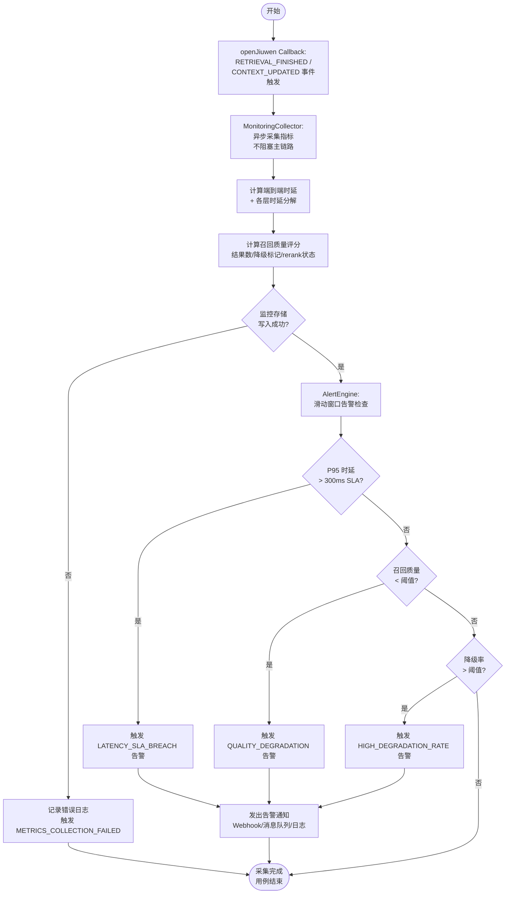

---

## 二、非功能性需求

### 2.1 性能

- **响应时间目标**
  - 热层记忆召回（UC002 热层）：P50 < 10ms，P95 < 20ms，P99 < 50ms
  - 多源聚合接口（UC001，内部源）：P50 < 100ms，P95 < 200ms，P99 < 300ms
  - JIT 检索（UC004，`MEMORY_REF`/`SCRATCHPAD_REF`）：P50 < 15ms，P95 < 30ms，P99 < 80ms
  - JIT 检索（UC004，`VECTOR_REF`/`GRAPH_REF`）：P50 < 80ms，P95 < 150ms，P99 < 250ms
  - 混合检索接口（UC012）：P50 < 150ms，P95 < 300ms，P99 < 500ms
  - LLM 压缩/摘要操作（UC009，异步执行）：P50 < 1s，P95 < 3s，P99 < 5s（不在主链路上）
  - **关键路径召回总体 SLA：P95 ≤ 300ms**（核心设计约束）

- **吞吐量 / 峰值并发**
  - ContextAgent 单实例支持 500 QPS 召回请求（混合类型）
  - 峰值并发上下文聚合请求：100 并发
  - 异步记忆处理队列：1000 任务/分钟（稳态）；峰值积压不超过 5000 任务

- **数据规模与增长预估**
  - 单 scope_id 长期记忆条目：≤ 100,000 条（超出触发冷层归档）
  - 工具描述索引：≤ 10,000 工具（支持检索式选择）
  - 上下文版本记录：每 context_id 保留最近 50 个版本 [推断值，请核实]
  - 监控指标数据：保留 30 天，预估日增量 500MB [推断值，请核实]

### 2.2 可靠性

- **可用性目标（SLA）**：99.9%（单月不可用时间 ≤ 43.8 分钟）[推断值，请核实]
- **故障恢复目标**
  - RTO（恢复时间目标）：< 5 分钟（热备切换）[推断值，请核实]
  - RPO（恢复点目标）：< 1 分钟（基于增量 checkpoint）[推断值，请核实]
- **数据一致性级别**
  - 工作记忆（UC010）：最终一致性（KV 写入后，跨实例可见延迟 ≤ 100ms）
  - 长期记忆（openJiuwen `LongTermMemory`）：最终一致性（异步处理完成后一致）
  - 上下文版本快照（UC013）：强一致性（快照写入原子，读写一致）
- **降级策略**
  - 外部向量数据库不可用：降级为仅关键词检索
  - 图数据库不可用：跳过 GRAPH 检索路，标注 `degraded`
  - LLM 服务不可用：压缩降级规则模式，记忆检测降级轻量去重
  - Redis 不可用：热层降级 in-memory KV（单节点，不支持跨实例共享）

### 2.3 可用性（Availability & Usability）

- **部署形态**
  - 支持单点部署（开发/轻量场景，使用 in-memory KV 和本地文件存储）
  - 支持多实例部署（生产场景，共享 Redis KV + 向量数据库 + 对象存储）
  - 不强依赖特定云平台，支持私有化部署
- **接口可用性**
  - ContextAgent 对外提供 Python SDK 接口（与 openJiuwen 风格一致，async/await）
  - 统一 API 通过 UC007 `ContextAPIRouter` 暴露，屏蔽内部 UC 细节
  - 所有接口提供明确的错误码和错误描述，禁止空响应

### 2.4 安全

- **身份认证与鉴权**
  - `scope_id` + `user_id` 组合作为数据隔离键，所有接口强制校验
  - 跨 `scope_id` 的数据访问请求返回 403，不泄露目标 scope 是否存在
  - ContextAgent 服务间调用通过 openJiuwen 框架内置鉴权机制处理

- **数据加密**
  - 传输加密：服务间通信使用 TLS 1.2+
  - 存储加密：敏感记忆数据（用户偏好、对话历史）使用 AES-256 加密（复用 openJiuwen `MemoryEngineConfig.crypto_key`）
  - 工作记忆和版本快照中的敏感字段同样加密存储

- **合规要求**
  - 用户数据隔离满足基础数据保护要求（数据不跨 scope 泄露）[具体合规标准（GDPR/等保）请核实]
  - 数据删除：支持按 `scope_id` 全量删除（复用 `LongTermMemory.delete_mem_by_scope`）

- **审计与日志保留**
  - 所有上下文读取、写入、删除、版本回滚操作记录审计日志（含操作类型、`scope_id`、`user_id`、时间戳、操作结果）
  - 审计日志保留 90 天（不可删除）[推断值，请核实]
  - 日志中不记录原始上下文内容，仅记录操作元数据和 item ID

### 2.5 可维护性

- **日志与可观测性**
  - 日志：结构化 JSON 日志，包含 `trace_id`（跨 UC 链路追踪）、`scope_id`、`uc_id`、`duration_ms`、`status`
  - 指标（Metrics）：复用 openJiuwen Callback Events + UC016 `MonitoringCollector`，上报至配置的指标存储（Prometheus/InfluxDB）
  - 链路追踪（Tracing）：支持 OpenTelemetry trace context 传播，与 openJiuwen 框架 trace 集成
  - 全链路 trace_id 从业务 Agent 调用入口透传到所有内部 UC 和 openJiuwen 原生调用

- **配置管理与热更新**
  - `ExposurePolicy`（UC006）支持热更新（不重启服务）
  - `AlertConfig`（UC016）支持热更新
  - `HybridStrategyConfig`（UC005）支持热更新
  - 压缩策略注册表（UC009）支持运行时动态注册新策略，不需重启

- **模块耦合与可扩展性约束**
  - ContextAgent 各 UC 通过接口（抽象类）而非具体实现相互依赖
  - openJiuwen 原生能力通过适配器（Adapter）调用，不直接依赖 openJiuwen 内部 private API
  - 新增上下文源：实现 `ExternalMemoryAdapter` 接口即可接入，不修改 `ContextAggregator` 核心逻辑
  - 新增压缩策略：实现 `CompressionStrategy` 接口并注册，不修改 `CompressionStrategyRouter`

### 2.6 产品生命周期管理

- **版本兼容性策略**
  - ContextAgent API 遵循语义化版本（Semantic Versioning）
  - 主版本号升级（Breaking Change）：至少 3 个月废弃通知期，同期提供迁移指南 [推断值，请核实]
  - 向后兼容承诺：次版本号升级不破坏现有调用方

- **数据迁移与升级策略**
  - 复用 openJiuwen `memory.migration`（含 KV migrator、SQL migrator、vector migrator）执行存储结构升级
  - 版本快照数据格式变更时，通过 `ContextVersionManager` 提供格式迁移工具
  - 工作记忆 schema 变更时，提供 schema 版本字段和向后兼容读取逻辑

- **下线 / 归档策略**
  - 冷层记忆（长期未访问，如 > 180 天）触发自动归档（移入低成本存储）[推断值，请核实]
  - `context_id` 过期策略：session 结束后工作记忆自动清理；持久上下文按配置 TTL 管理
  - 上下文版本超出保留上限（50 个）时 FIFO 自动清理最旧版本

### 2.7 可测试性

- **测试环境隔离**
  - 所有外部依赖（向量数据库、图数据库、LLM 服务、Redis）提供 Mock/Stub 实现
  - `ContextAgent` 提供测试模式（`test_mode=True`）：异步操作同步执行，跳过真实存储写入
  - 各 UC 的 `scope_id` 在测试中使用独立前缀，防止测试数据污染生产数据

- **自动化测试覆盖率目标**
  - 核心业务逻辑（UC001-UC016 主成功场景 + 关键扩展场景）：行覆盖率 ≥ 80% [推断值，请核实]
  - 关键路径（召回、压缩、暴露控制、版本回滚）：行覆盖率 ≥ 90% [推断值，请核实]
  - 性能回归测试：关键路径 P95 时延测试在 CI 中自动运行

- **可注入的 Stub / Mock 点说明**

  | 组件 | Mock 点 | 目的 |
  |------|---------|------|
  | `LongTermMemory` | `search_user_mem`, `add_messages`, `get_recent_messages` | 控制记忆内容，测试聚合逻辑 |
  | `ExternalMemoryAdapter` | `fetch(ref)` | 模拟外部存储可用/不可用 |
  | `MemUpdateChecker` | LLM 调用 | 模拟冗余/冲突检测结果 |
  | `HybridRetriever` | `retrieve()` | 控制检索结果，测试 fusion 逻辑 |
  | `AgenticRetriever` | `retrieve()` | 测试 JIT 引用解析路径 |
  | `DialogueCompressor` | `on_add_messages()` | 控制压缩触发条件 |
  | `TaskMemoryService` | `summarize()`, `retrieve()` | 测试摘要质量和格式 |
  | `MonitoringCollector` | 指标写入 | 断言指标采集正确性 |
  | `AlertEngine` | 告警触发 | 测试告警阈值逻辑 |
  | 时钟（`datetime.now`） | 注入 mock 时钟 | 测试超时、TTL、滑动窗口逻辑 |

